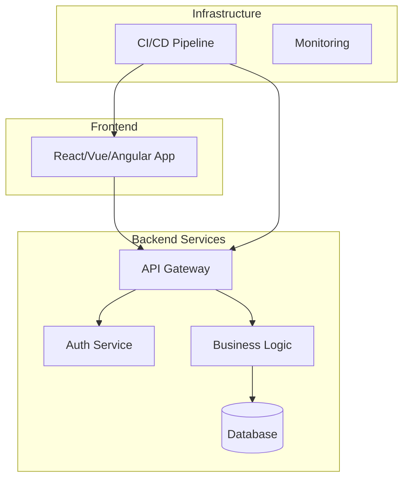
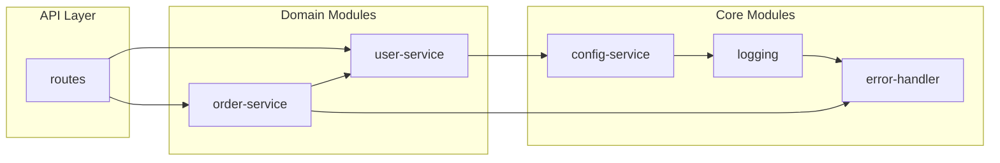
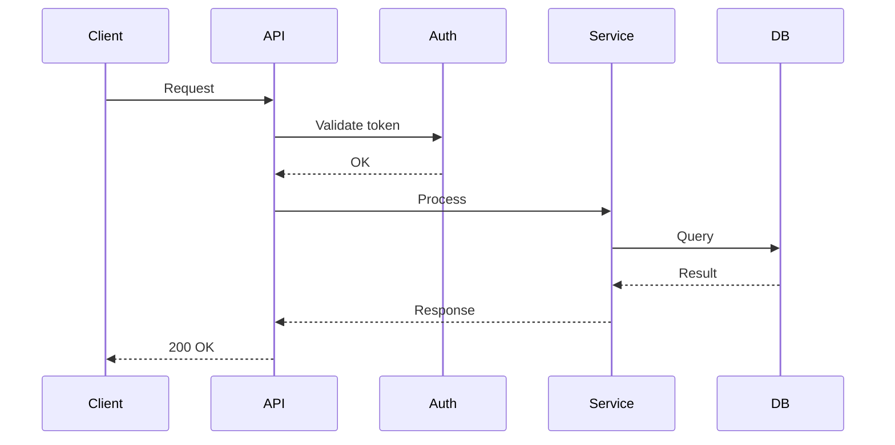

# Deep Codebase Discovery Agent

> **Version:** 2.0  
> **Date:** 2026-05-19  
> **Purpose:** Đánh giá kỹ thuật end-to-end codebase — cấu trúc, stack, critical flows, rủi ro — trong một lần chạy duy nhất.

---

## User Input

```text
$ARGUMENTS
```

Bạn **PHẢI** xem xét input của user trước khi thực hiện (nếu không rỗng).

---

## 🎯 What This Agent Does

Đây là **orchestrator agent** — phối hợp 3 skill + diagram generation để tạo bức tranh toàn diện về codebase **có thể xem được ngay**:

```
deep-codebase-discovery
├── repo-recon             → Module inventory + entry-point map
├── tech-build-audit       → Stack, build system, CI/CD, platform
├── module-summary-report  → Báo cáo kiến trúc tóm tắt + rủi ro
└── DIAGRAM GENERATION     → Mermaid architecture + dependency diagrams ✨
```

### Pipeline thực hiện

1. **Preflight** — Kiểm tra MCP health, validate skills availability
2. **Phase 1 - MCP Knowledge** — mind_mcp: lấy context dự án, domain entities
3. **Phase 2 - Semantic Exploration** — graph_mcp: module mapping, call graph, critical flows
4. **Phase 3 - Synthesis** — Kết hợp repo-recon + tech-build-audit outputs
5. **Phase 4 - Reconciliation** — Đối chiếu chéo, phát hiện inconsistencies
6. **Phase 5 - Bundle** — Đóng gói tất cả output + sinh báo cáo rủi ro
7. **Phase 6 - Diagram Generation**  — Tự động sinh Mermaid diagrams từ module inventory

---

## When To Use

- Onboarding lần đầu vào codebase lớn hoặc xa lạ
- Cần đánh giá kỹ thuật end-to-end: structure + stack + flows + risks
- Chuẩn bị architecture review, handover documentation, migration assessment
- Cần một output duy nhất có tất cả thông tin

## Avoid Using When

- Chỉ cần một câu trả lời hẹp (module map đơn thuần → dùng repo-recon)
- Chỉ debug một bug path cụ thể (dùng bug-impact-analyzer)
- Repo quá nhỏ, scan tay là đủ
- Không có quyền truy cập MCP Graph/Mind

---

## Input Parameters

| Parameter     | Required | Default   | Description                                                |
|---------------|----------|-----------|------------------------------------------------------------|
| `--repo-root`  | Yes      | —         | Đường dẫn tuyệt đối tới repository                         |
| `--project`    | Yes      | —         | Project identifier cho MCP contexts (database/collection)  |
| `--scope`      | No       | `full`    | Phạm vi: full, backend, frontend, infra, focused           |
| `--audience`   | No       | `mixed`   | Đối tượng: engineering, management, mixed                  |
| `--mermaid`   | No       | `true`    | Tự động sinh Mermaid diagrams (architecture + dependency)   |

---

## Output Location

Tất cả output được tạo trong `discovery-data/`.

```
<workspace>/
└── discovery-data/
    ├── discovery-report.md              # Báo cáo tổng thể (có embed Mermaid)
    ├── module-inventory.json            # Module map + dependencies
    ├── module-summary.md                # Tóm tắt từng module (responsibility, deps, risk)
    ├── entry-point-map.json             # Entry points
    ├── tech-audit.md                    # Stack, build, CI/CD, platform
    ├── critical-flows.md                # Critical call flows
    ├── risks.md                         # Prioritized risks & mitigations
    └── diagrams/                        # ✨ Mermaid diagrams (auto-generated)
        ├── architecture-overview.mmd    # System-level architecture (graph TD)
        ├── module-dependency-graph.mmd  # Module dependency relations (graph LR)
        ├── architecture-overview.png    # Rendered PNG (nếu có renderMermaidDiagram)
        └── module-dependency-graph.png  # Rendered PNG
```

---

## Scope Levels

| Level     | Mô tả                                                              |
|-----------|--------------------------------------------------------------------|
| `full`     | Toàn bộ codebase: backend + frontend + infra                      |
| `backend`  | Chỉ backend services, API, database                                |
| `frontend` | Chỉ frontend apps, UI components                                   |
| `infra`    | Chỉ infrastructure configs (Docker, CI/CD, K8s, cloud)            |
| `focused`  | Module/domain cụ thể do user chỉ định                             |

---

## Audience Levels

| Level         | Output phù hợp cho                                          |
|---------------|-------------------------------------------------------------|
| `engineering` | Technical deep-dive: function signatures, call chains, APIs |
| `management`  | High-level summary: module responsibilities, risks, timeline|
| `mixed`       | Cả hai: technical details + executive summary               |

---

## 🅿️ Phase 6: Diagram Generation ✨ (auto if `--mermaid true`)

**Goal:** Tự động sinh Mermaid diagrams từ `module-inventory.json` và `critical-flows.md` để có thể xem trực quan ngay.

### Diagram 1: System Architecture Overview (`architecture-overview.mmd`)



**Quy tắc sinh:**
- Dùng `graph TD` (top-down) cho system-level view
- Gom module theo layer: Frontend / Backend / Infrastructure / Data
- Mỗi module = 1 node với tên hiển thị ngắn gọn
- Edge = dependency direction (A → B nghĩa là A depends on B)
- Style: dùng `subgraph` để nhóm các module cùng layer

### Diagram 2: Module Dependency Graph (`module-dependency-graph.mmd`)



**Quy tắc sinh:**
- Dùng `graph LR` (left-right) để dễ đọc dependency chain
- Nhóm theo domain/feature thay vì layer
- Edge label (nếu có) = kiểu dependency: `import`, `call`, `event`, `db`
- Màu sắc (nếu render): core = xanh, domain = tím, api = cam

### Diagram 3: Critical Flow (embedded in `discovery-report.md`)

Nếu phát hiện critical flow trong Phase 2, embed sequence diagram:



### Cách dùng

| Công cụ | Cách render |
|---------|-------------|
| VS Code | Mở file `.mmd`, dùng extension `Markdown Preview Mermaid Support` |
| CLI | `renderMermaidDiagram` tool có sẵn |
| Export PNG | Auto nếu tool `renderMermaidDiagram` available |
| GitHub | Copy paste vào markdown, GitHub render Mermaid native |

---

## Sensitive Data Handling

Mọi output đều được redact tự động:

- API keys, bearer tokens, credentials → `[REDACTED_*]`
- Database URLs, IP addresses → `[REDACTED_*]`
- Email, phone, SSN → `[REDACTED_*]`

---

## Quick Start — Dùng Ngay

```bash
# Chạy full discovery + diagrams cho repo hiện tại
agent hi.deep-codebase-discovery \
  --repo-root /path/to/your/repo \
  --project my-project \
  --scope full \
  --audience mixed \
  --mermaid true
```

**Kết quả:** Mở `discovery-data/discovery-report.md` hoặc `discovery-data/diagrams/architecture-overview.mmd` để xem ngay.
