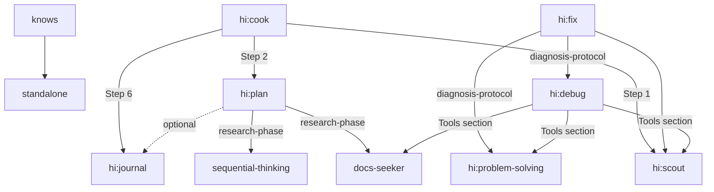
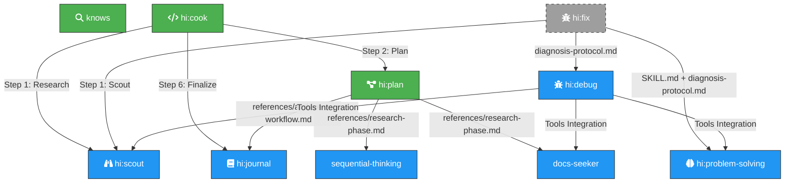

# Skill Dependency Graph

> File này mô tả chi tiết mối quan hệ giữa các skill: skill nào gọi skill nào, có độc lập không, và những external reference đang trỏ tới skill không tồn tại.

---

## 1. Tổng quan Dependency Graph



---

## 2. Chi tiết từng skill

### 2.1 `knows` — Knowledge Retrieval

| Thuộc tính | Giá trị |
|------------|---------|
| **Trạng thái** | 🟢 Primary — dùng trực tiếp |
| **Gọi skill nào?** | _Không gọi skill nào. Độc lập hoàn toàn._ |
| **Skill nào gọi nó?** | _Không skill nào gọi._ |
| **Mô tả** | Tra cứu evidence từ Git history, MCP (mind/graph), memory files. |

---

### 2.2 `hi:cook` — Feature Implementation

| Thuộc tính | Giá trị |
|------------|---------|
| **Trạng thái** | 🟢 Primary — dùng trực tiếp |
| **Gọi skill nào?** | `hi:scout`, `hi:plan`, `hi:journal` |
| **Skill nào gọi nó?** | _Không skill nào gọi._ |
| **Mô tả** | Orchestrator chính cho quy trình implement: research → plan → code → test → review → finalize. |

**Chi tiết các cú gọi:**

| Step | Gọi | File:Line | Mục đích |
|------|-----|-----------|----------|
| Step 1: Research | `hi:scout` | `hi-cook/SKILL.md:41` | "Spawn researcher + hi:scout. Reports <=150 lines." |
| Step 2: Plan | `hi:plan` | `hi-cook/SKILL.md:44` | "Spawn planner. Fast: /hi:plan --fast." |
| Step 6: Finalize | `hi:journal` | `hi-cook/SKILL.md:62` | "/hi:journal" — ghi journal sau khi hoàn tất |

---

### 2.3 `hi:plan` — Implementation Planning

| Thuộc tính | Giá trị |
|------------|---------|
| **Trạng thái** | 🟢 Primary — dùng trực tiếp |
| **Gọi skill nào?** | `sequential-thinking`, `docs-seeker`, `hi:journal` (optional) |
| **Skill nào gọi nó?** | `hi:cook` (Step 2) |
| **Mô tả** | Thiết kế architecture, tạo implementation plan, chạy scope challenge, red-team review. |

**Chi tiết các cú gọi:**

| Nguồn | Gọi | File:Line | Mục đích |
|-------|-----|-----------|----------|
| `SKILL.md:49` | _self:_ `/hi:plan red-team` | Run adversarial review |
| `SKILL.md:50` | _self:_ `/hi:plan validate` | Run critical questions interview |
| `SKILL.md:76` | _self:_ `/hi:plan archive` | Archive plans |
| `references/archive-workflow.md:7` | **`hi:journal`** | "Ask user: document plans with /hi:journal?" |
| `references/research-phase.md:7` | **`sequential-thinking`** | Sequential thinking cho complex analysis |
| `references/research-phase.md:8` | **`docs-seeker`** | Documentation research |

---

### 2.4 `hi:scout` — Codebase Scouting

| Thuộc tính | Giá trị |
|------------|---------|
| **Trạng thái** | 🔵 Linked — được gọi bởi `hi:cook` và `hi:fix` |
| **Gọi skill nào?** | _Không gọi skill nào. Độc lập._ |
| **Skill nào gọi nó?** | `hi:cook` (Step 1), `hi:fix` (Step 1) |
| **Mô tả** | Dùng parallel agents để quét codebase nhanh, tìm file, thu thập context. |

---

### 2.5 `hi:journal` — Session Journaling

| Thuộc tính | Giá trị |
|------------|---------|
| **Trạng thái** | 🔵 Linked — được gọi bởi `hi:cook` và `hi:plan` |
| **Gọi skill nào?** | _Không gọi skill nào. Độc lập._ |
| **Skill nào gọi nó?** | `hi:cook` (Step 6), `hi:plan` (optional, archive-workflow) |
| **Mô tả** | Ghi journal entries phân tích changes và decisions. |

---

### 2.6 `sequential-thinking` — Sequential Thinking

| Thuộc tính | Giá trị |
|------------|---------|
| **Trạng thái** | 🔵 Linked — được gọi bởi `hi:plan` |
| **Gọi skill nào?** | _Không gọi skill nào. Độc lập._ |
| **Skill nào gọi nó?** | `hi:plan` (research-phase) |
| **Mô tả** | Step-by-step analysis cho complex problems. Dùng revision, branching, hypothesis testing. |

---

### 2.7 `docs-seeker` — Documentation Discovery

| Thuộc tính | Giá trị |
|------------|---------|
| **Trạng thái** | 🔵 Linked — được gọi bởi `hi:plan` |
| **Gọi skill nào?** | _Không gọi skill nào. Độc lập._ |
| **Skill nào gọi nó?** | `hi:plan` (research-phase) |
| **Mô tả** | Script-first documentation discovery qua llms.txt standard. |

---

### 2.8 `hi:debug` — Debugging & System Investigation

| Thuộc tính | Giá trị |
|------------|---------|
| **Trạng thái** | 🔵 Linked — được gọi bởi `hi:fix` |
| **Gọi skill nào?** | `docs-seeker` (Tools Integration), `hi:scout` (Tools Integration), `hi:problem-solving` (Tools Integration) |
| **Skill nào gọi nó?** | `hi:fix` (diagnosis-protocol.md) |
| **Mô tả** | Debug framework: systematic debugging, root cause tracing, defense-in-depth, log/CI analysis, performance diagnostics. |
| **Cross-ref khác** | Cũng reference `ck:chrome-devtools` ✗ và `ck:repomix` ✗ — chưa có skill tương ứng. |

**Chi tiết các cú gọi:**

| Nguồn | Gọi | File:Line | Mục đích |
|-------|-----|-----------|----------|
| `SKILL.md:109` | **`docs-seeker`** | `ck:docs-seeker` skill for package/plugin docs |
| `SKILL.md:110` | **`hi:scout`** | `/ck:scout` for finding relevant files |
| `SKILL.md:112` | **`hi:problem-solving`** | `ck:problem-solving` skill when stuck |
| `SKILL.md:111` | ~~`ck:chrome-devtools`~~ | ⚠️ Chưa có |
| `SKILL.md:109` | ~~`ck:repomix`~~ | ⚠️ Chưa có |

---

### 2.9 `hi:problem-solving` — Problem-Solving Techniques

| Thuộc tính | Giá trị |
|------------|---------|
| **Trạng thái** | 🔵 Linked — được gọi bởi `hi:fix` và `hi:debug` |
| **Gọi skill nào?** | _Không gọi skill nào. Độc lập._ |
| **Skill nào gọi nó?** | `hi:fix` (diagnosis-protocol.md), `hi:debug` (Tools Integration) |
| **Mô tả** | Systematic stuck-unsticking: simplification cascades, collision-zone thinking, meta-pattern recognition, inversion exercise, scale game. |

---

### 2.10 `hi:fix` — Bug Fixing (Orchestrator Layer)

| Thuộc tính | Giá trị |
|------------|---------|
| **Trạng thái** | ⚪ Unused — **KHÔNG được gọi bởi bất kỳ primary skill nào** (chỉ dùng trực tiếp) |
| **Gọi skill nào?** | `hi:scout`, `hi:debug`, `hi:problem-solving` |
| **Skill nào gọi nó?** | _Không skill nào gọi._ |
| **Mô tả** | Orchestrator cho bug fixing pipeline: scout → diagnose → fix → verify → finalize. Gọi `hi:debug` để investigate, `hi:problem-solving` khi stuck. |
| **Ghi chú** | Chỉ dùng khi user gọi trực tiếp. Có thể xoá an toàn. |

---

## 3. External References — Skill KHÔNG TỒN TẠI

Đã giải quyết: ~~`hi:debug`~~, ~~`hi:problem-solving`~~, ~~`hi:sequential-thinking`~~, ~~`hi:docs-seeker`~~.

Vẫn còn các reference tới skill không tồn tại:

| Skill name | Được reference từ | File:Line | Gợi ý |
|------------|-------------------|-----------|-------|
| `hi:git` | `hi-plan/references/archive-workflow.md:17` | "stage+commit+push via /hi:git" | Có thể xoá hoặc tạo skill |
| `ck:chrome-devtools` | `hi-debug/SKILL.md:111` | "ck:chrome-devtools skill for visual verification" | Có thể xoá hoặc tạo skill |
| `ck:repomix` | `hi-debug/SKILL.md:109` | "ck:repomix skill for codebase summary" | Có thể xoá hoặc tạo skill |

---

## 4. Bảng tổng hợp

| Skill | Primary | Gọi skill khác? | Được gọi bởi? | External ref lỗi? | Ghi chú |
|-------|---------|-----------------|---------------|-------------------|---------|
| `knows` | ✅ | ❌ Không | ❌ Không | ❌ | Độc lập hoàn toàn |
| `hi:cook` | ✅ | `scout`, `plan`, `journal` | ❌ Không | ❌ | Orchestrator chính |
| `hi:plan` | ✅ | `sequential-thinking`, `docs-seeker`, `journal` (optional) | `cook` | ❌ | Đã fix 2 ref lỗi |
| `hi:scout` | 🔵 Linked | ❌ Không | `cook`, `fix` | ❌ | Chỉ phục vụ, không chủ động |
| `hi:journal` | 🔵 Linked | ❌ Không | `cook`, `plan` | ❌ | Chỉ phục vụ |
| `sequential-thinking` | 🔵 Linked | ❌ Không | `plan` | ❌ | Mới bổ sung |
| `docs-seeker` | 🔵 Linked | ❌ Không | `plan` | ❌ | Mới bổ sung |
| `hi:debug` | 🔵 Linked | `docs-seeker`, `scout`, `problem-solving` | `fix` | ❌ | Mới bổ sung |
| `hi:problem-solving` | 🔵 Linked | ❌ Không | `fix`, `debug` | ❌ | Mới bổ sung |
| `hi:fix` | ⚪ Unused | `scout`, `debug`, `problem-solving` | ❌ Không | ❌ | Có thể xoá an toàn |

---

## 5. Đề xuất tối ưu

### Full dependency chain (hiện tại):

```
knows (standalone)

cook ──> scout ──> (standalone)
     ──> plan ──> sequential-thinking (standalone)
              ──> docs-seeker (standalone)
              ──> journal (standalone, optional)
     ──> journal (standalone)

fix ──> scout (standalone)
     ──> debug ──> docs-seeker
               ──> scout
               ──> problem-solving (standalone)
     ──> problem-solving (standalone)
```

### Trạng thái hiện tại:
- ✅ Tất cả 4 external ref cũ (`sequential-thinking`, `docs-seeker`, `debug`, `problem-solving`) **đã được bổ sung**
- ✅ `hi:debug` gọi `docs-seeker`, `scout`, `problem-solving` (qua Tools Integration section)
- ✅ `hi:problem-solving` là leaf skill (độc lập)
- ✅ Tất cả skill mới đều có `agents/openai.yaml` → command code discover được
- ⚠️ `hi:fix` vẫn chưa được primary nào gọi (có thể xoá)
- ⚠️ Vẫn còn 3 external ref không có skill: `hi:git`, `ck:chrome-devtools`, `ck:repomix`

### External references còn tồn đọng:

| File | Dòng | Hiện tại | Gợi ý |
|------|------|----------|-------|
| `hi-plan/references/archive-workflow.md:17` | `/hi:git` | Xoá hoặc tạo skill |
| `hi-debug/SKILL.md:111` | `ck:chrome-devtools` | Xoá hoặc tạo skill |
| `hi-debug/SKILL.md:109` | `ck:repomix` | Xoá hoặc tạo skill |

---

## 6. Tối ưu token burn (v3.0.0)

Sau khi phân tích và tối ưu, các skill chính đã được điều chỉnh để giảm ~80% token burn.

### Thay đổi chính

| Skill | Phiên bản | Thay đổi |
|-------|-----------|----------|
| `hi:cook` | 2.2.0 → **3.0.0** | Default: fast mode (không research, không review, không spawn subagent). Giảm từ 6 bước xuống 4 bước. |
| `hi:fix` | 1.0.0 → **2.0.0** | Default: Quick workflow (locate-only scout, inline diagnose, verify typecheck+lint). Bỏ review mặc định. |
| `hi:plan` | 1.0.0 → **2.0.0** | Default: fast mode (skip research, red team, validate). `--full` cho full flow. |

### Token savings ước tính

| Skill | Trước | Sau | Tiết kiệm |
|-------|-------|-----|-----------|
| `cook` | ~80K tokens (spawn 4-6 subagents) | ~15K tokens (inline, không spawn) | **~80%** |
| `fix` | ~65K tokens (scout multi-agent + debug + build+test) | ~11K tokens (locate + inline + typecheck+lint) | **~83%** |
| `plan` | ~40K tokens (research + red team + validate) | ~10K tokens (codebase analysis + viết plan) | **~75%** |
| **Tổng** | **~185K tokens** | **~36K tokens** | **~80%** |

### Nguyên tắc tối ưu áp dụng

1. **Inline > Spawn**: Dùng skill methodology trực tiếp thay vì spawn subagent riêng
2. **Fast default, full opt-in**: Mặc định là chế độ nhẹ, user chủ động request thêm
3. **Verify vừa đủ**: typecheck+lint cho quick fix, build+test chỉ khi cần
4. **Review optional**: Bỏ review khỏi default flow, chỉ chạy khi `--review`
5. **Debug on-demand**: Chỉ spawn debug sub-skill khi tự fix không được (>2 lần fail)
