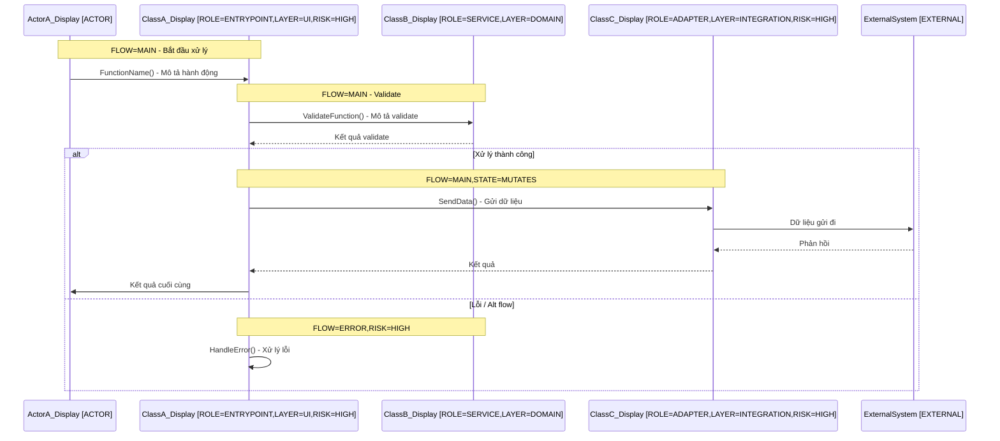
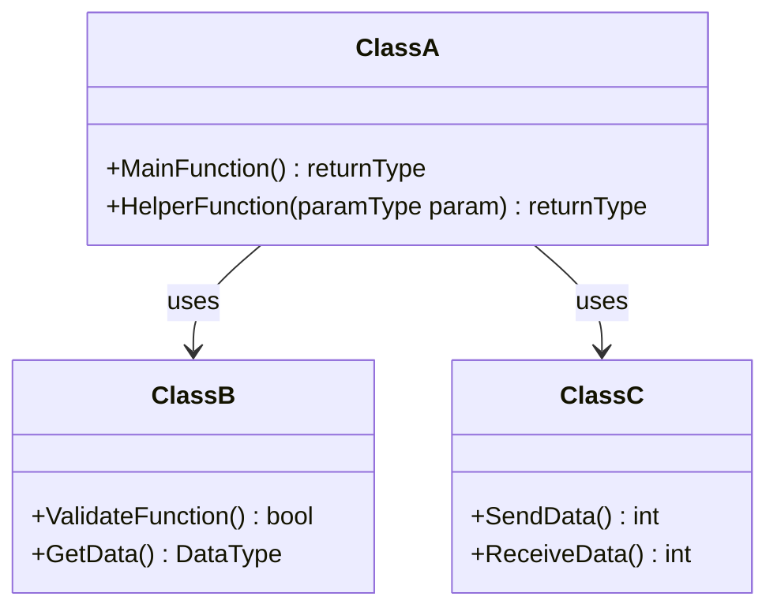

# UCxxx: {Tên Use Case}

## 1. Meta

- **Mã Use Case**: UCxxx
- **Tên**: {Tên Use Case}
- **Ngày tạo**: `{YYYY-MM-DD}`
- **Người phụ trách**: {Tên}
- **Trạng thái**: `{Draft | In Review | Reviewed | Approved}`

---

## 2. Mô Tả Ngắn

{Mô tả 1-3 dòng: use case này xử lý gì, từ đầu đến cuối, ai là người khởi tạo và kết quả cuối cùng là gì.}

---

## 3. Actors

| Actor    | Loại       | Mô tả           |
| -------- | ---------- | --------------- |
| {Actor1} | `Primary`  | {Mô tả vai trò} |
| {Actor2} | `System`   | {Mô tả vai trò} |
| {Actor3} | `External` | {Mô tả vai trò} |

---

## 4. Preconditions

- [ ] {Điều kiện tiên quyết 1}
- [ ] {Điều kiện tiên quyết 2}
- [ ] {Điều kiện tiên quyết 3}

---

## 5. Postconditions

- **State cập nhật**: {Mô tả trạng thái sau khi UC kết thúc}
- **Log / Audit**: {Ghi nhận gì vào log}
- **Event phát sinh**: {Event, notification, hoặc side-effect nào xảy ra}

---

## 6. Main Flow (Business Steps)

| Step | Mô tả nghiệp vụ | Function/Entry (dự kiến)    | Annotation dự kiến                   |
| ---- | --------------- | --------------------------- | ------------------------------------ |
| 1    | {Bước 1}        | `{ClassName::FunctionName}` | `ROLE=ENTRYPOINT,LAYER=UI,FLOW=MAIN` |
| 2    | {Bước 2}        | `{FunctionName}`            | `ROLE=SERVICE,FLOW=MAIN`             |
| 3    | {Bước 3}        | `{FunctionName}`            | `ROLE=CONTROLLER,FLOW=MAIN`          |
| 4    | {Bước 4}        | `{FunctionName}`            | `ROLE=SERVICE,FLOW=MAIN,STATE=I/O`   |
| 5    | {Bước 5}        | `{StateName}`               | `FLOW=MAIN`                          |

---

## 7. Alternate / Error Flows

| Flow ID | Điều kiện kích hoạt         | Khác biệt so với main    | Function xử lý   | Tag                    |
| ------- | --------------------------- | ------------------------ | ---------------- | ---------------------- |
| ALT-1   | {Điều kiện}                 | {Mô tả rẽ nhánh}         | `{FunctionName}` | `FLOW=ALT`             |
| ERR-1   | {Điều kiện lỗi}             | {Mô tả xử lý lỗi}        | `{FunctionName}` | `FLOW=ERROR,RISK=HIGH` |
| ERR-2   | {Timeout / network failure} | {Retry hoặc error state} | `{FunctionName}` | `FLOW=ERROR`           |

---

## 8. Critical Checkpoints (Validation, Security, Performance)

| Loại        | Mục tiêu / Nguyên nhân | Function liên quan | Chiến lược / Loại | Tag            |
| ----------- | ---------------------- | ------------------ | ----------------- | -------------- |
| Auth        | {Mô tả}                | `{FunctionName}`   | Permission        | `RISK=HIGH`    |
| Validation  | {Mô tả}                | `{FunctionName}`   | Business rule     | `RISK=HIGH`    |
| Security    | {Mô tả}                | `{FunctionName}`   | Encryption        | `RISK=HIGH`    |
| Performance | {Mô tả}                | `{FunctionName}`   | Timeout handling  | `FLOW=TIMEOUT` |

---

## 9. Mapping Sang Diagram

- **Sequence Diagram file**: `seq_ucXXX_{YYYYMMDD}_v{N}.mmd`
- **Class Diagram liên quan**: `class_{module}_{YYYYMMDD}_v{N}.mmd`
- **Node trọng tâm (HIGH RISK)**: `{FunctionName1}`, `{FunctionName2}`

---

## 10. Sequence Diagram (Mermaid Inline)

---

## 11. Class Diagram (Mermaid Inline)

---

## 12. Metrics Liên Quan Use Case

| Metric                     | Target  | Hiện tại |
| -------------------------- | ------- | -------- |
| Steps covered (%)          | 100%    | {N}%     |
| Alt/Error covered (%)      | >=80%   | {N}%     |
| Entry points annotated     | All     | {N}/{N}  |
| RISK=HIGH nodes traced     | All     | {N}/{N}  |
| Inter-module IPC traced    | All     | {N}/{N}  |
| Function signatures traced | All key | {N}/{N}  |

**Annotated Nodes**:

- `{FunctionName}` ({line}): `ROLE=ENTRYPOINT,LAYER={layer},RISK={level},FLOW=MAIN`

**Inter-Module Communications**:

- {Module} ({Chức năng}): `{COMM_ID_REQ}/{COMM_ID_ANS}` — {Mô tả}

---

## 13. Edge Cases & Follow-Up

**Edge Cases**:

- {Race condition / partial state / timeout scenario}

**Items Chưa Rõ**:

- [ ] {Câu hỏi còn mở 1}
- [ ] {Câu hỏi còn mở 2}

---

## 14. Quy Tắc Hoàn Thành Use Case

- [ ] Sequence diagram có main + ≥80% alt/error
- [ ] Tất cả entry points có `ROLE=ENTRYPOINT`
- [ ] Không còn `RISK=HIGH` chưa annotate
- [ ] Class diagram phản ánh đầy đủ domain objects
- [ ] Metrics >= target
- [ ] Inter-module IPC communications traced
- [ ] Function signatures và code-level interactions traced

---

## 15. Lịch Sử Phiên Bản

| Ngày           | Phiên bản | Người | Mô tả                    |
| -------------- | --------- | ----- | ------------------------ |
| `{YYYY-MM-DD}` | v1        | {Tên} | Khởi tạo từ tool tracing |
| `{YYYY-MM-DD}` | v1.1      | {Tên} | {Mô tả thay đổi}         |

---

> **Note**: Cập nhật metrics vào `tpl_usecase_metrics.md` sau khi hoàn tất.
