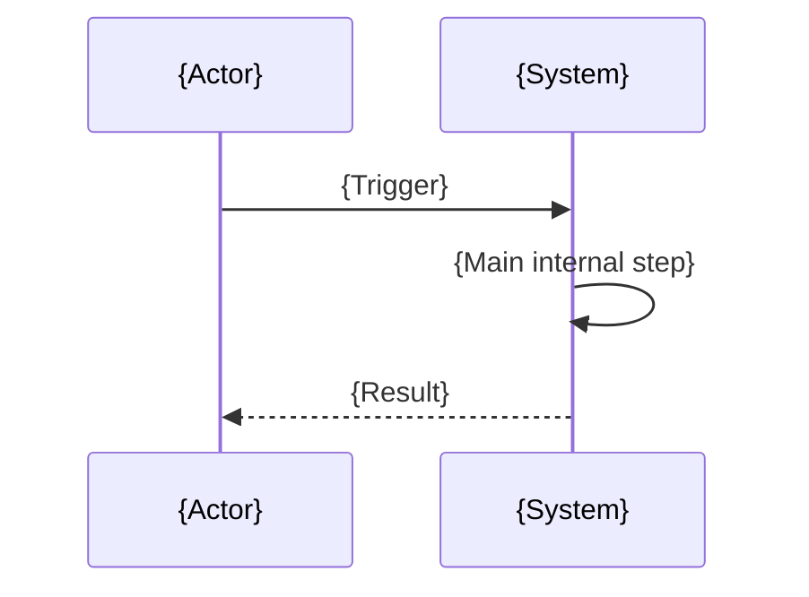

# Generic Use Case Detail — {Use Case Name}

## 1. Document Info

| Field | Value |
| --- | --- |
| Document ID | `UC-DET-{NNN}` |
| Use case | `{Name}` |
| Scope | `{Module / Feature / Service}` |
| Version | `v0.1` |
| Created | `{YYYY-MM-DD}` |
| Owner | `{Name}` |
| Status | `{Draft / Review / Approved}` |

---

## 2. Goal and Context

- Business goal: `{What this use case achieves}`
- Trigger: `{What starts the flow}`
- Risk level: `{HIGH / MEDIUM / LOW}`

---

## 3. Actors

| Actor | Type | Responsibility |
| --- | --- | --- |
| `{Primary actor}` | `Primary` | `{Role}` |
| `{Secondary actor}` | `Secondary` | `{Role}` |

---

## 4. Preconditions / Postconditions

### Preconditions
- {Condition 1}
- {Condition 2}

### Postconditions
- {Condition 1}
- {Condition 2}

---

## 5. Main Flow

| Step | Action | Symbol / Artifact | Annotation |
| --- | --- | --- | --- |
| 1 | {Action} | `{symbol}` | `ROLE=...` |
| 2 | {Action} | `{symbol}` | `FLOW=MAIN` |
| 3 | {Action} | `{symbol}` | `STATE=...` |

---

## 6. Alternate and Error Flows

### Alternate Flow
- AF-1: {Scenario}
- AF-2: {Scenario}

### Error Flow
- EF-1: {Scenario}
- EF-2: {Scenario}

---

## 7. Critical Checkpoints

- Validation
- Security
- Performance
- Consistency
- Retry / timeout handling

---

## 8. Diagrams

### Sequence diagram


### Class diagram
```mermaid
classDiagram
    class {EntityA}
    class {EntityB}
    {EntityA} --> {EntityB}
```

---

## 9. Metrics

| Metric | Value |
| --- | --- |
| Entry points traced | `{n}` |
| Alt flows documented | `{n}` |
| Error flows documented | `{n}` |
| High-risk nodes | `{n}` |

---

## 10. Edge Cases

- {Edge case 1}
- {Edge case 2}
- {Edge case 3}

---

## 11. Traceability

| Requirement / Intent | UC step | Symbol / Artifact |
| --- | --- | --- |
| `{Requirement}` | `{Step}` | `{symbol}` |

---

## 12. Completion Notes

- Open questions: {if any}
- Follow-up actions: {if any}
