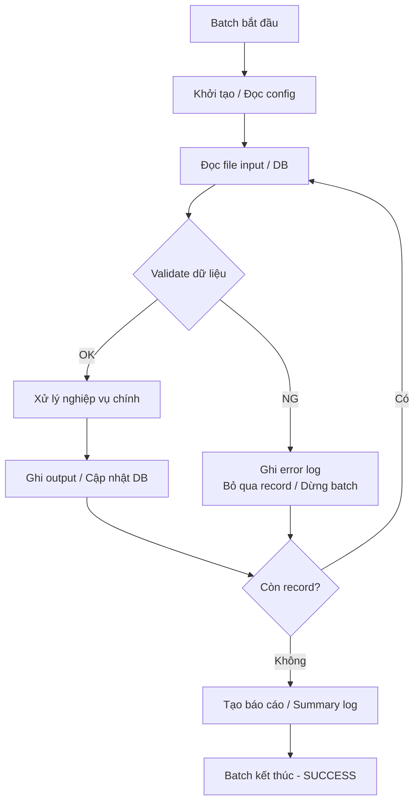

# 【Mẫu】Tài liệu Thiết kế Xử lý Batch

## Thông tin cơ bản

| Mục                              | Nội dung                              |
| -------------------------------- | ------------------------------------- |
| **Batch ID**                     | `{BatchID}`                           |
| **Tên xử lý**                    | `{Tên Batch}`                         |
| **Phiên bản**                    | v0.00                                 |
| **Ngày tạo**                     | `{YYYY-MM-DD}`                        |
| **Người tạo**                    | `{Tên người tạo}`                     |
| **Tài liệu thiết kế cơ bản gốc** | `{Tên file tài liệu thiết kế cơ bản}` |

---

## 1. Tổng quan Batch

| Mục                        | Nội dung                                  |
| -------------------------- | ----------------------------------------- |
| **Mục đích**               | `{Mô tả mục đích batch}`                  |
| **Loại xử lý**             | `{Xử lý tuần tự / Song song / Phân vùng}` |
| **Trigger**                | `{Cron schedule / Event-driven / Manual}` |
| **Lịch chạy**              | `{ví dụ: 0 2 * * * — mỗi ngày lúc 02:00}` |
| **Môi trường chạy**        | `{Server / Container / Cloud Function}`   |
| **Thời gian chạy dự kiến** | `{N}` phút/giờ                            |
| **Timeout**                | `{N}` phút                                |

---

## 2. Điều kiện tiên quyết & Hậu điều kiện

### Điều kiện tiên quyết (Preconditions)

- {Batch/Job trước đó đã hoàn thành}
- {File input đã tồn tại tại {path}}
- {DB connection available}

### Hậu điều kiện (Postconditions)

- {File output được tạo tại {path}}
- {Bảng DB đã được cập nhật}
- {Log ghi nhận: ...}

---

## 3. Định nghĩa File Input

| Mục                  | Nội dung                                  |
| -------------------- | ----------------------------------------- |
| **Tên file logic**   | `{Tên file logic}`                        |
| **Tên file vật lý**  | `{Tên file vật lý / Pattern}`             |
| **Thư mục**          | `{Đường dẫn thư mục input}`               |
| **Định dạng**        | `{CSV / TSV / XML / JSON / Fixed-length}` |
| **Encoding**         | `{UTF-8 / Shift-JIS}`                     |
| **Ký tự xuống dòng** | `{CR+LF / LF}`                            |
| **Có header**        | `{Có / Không}`                            |

### Cấu trúc record input

| No. | Tên cột / Field | Kiểu     | Độ dài | Bắt buộc | Mô tả     |
| --- | --------------- | -------- | ------ | -------- | --------- |
| 1   | `{field1}`      | `{Kiểu}` | `{N}`  | Yes/No   | `{Mô tả}` |
| 2   | `{field2}`      | `{Kiểu}` | `{N}`  | Yes/No   | `{Mô tả}` |

---

## 4. Định nghĩa File Output

| Mục                 | Nội dung                                  |
| ------------------- | ----------------------------------------- |
| **Tên file logic**  | `{Tên file logic}`                        |
| **Tên file vật lý** | `{Tên file vật lý / Pattern}`             |
| **Thư mục**         | `{Đường dẫn thư mục output}`              |
| **Định dạng**       | `{CSV / TSV / XML / JSON / Fixed-length}` |
| **Encoding**        | `{UTF-8 / Shift-JIS}`                     |

### Cấu trúc record output

| No. | Tên cột / Field | Kiểu     | Độ dài | Nguồn dữ liệu                        | Mô tả     |
| --- | --------------- | -------- | ------ | ------------------------------------ | --------- |
| 1   | `{field1}`      | `{Kiểu}` | `{N}`  | `{Input.field1 / DB.col / Computed}` | `{Mô tả}` |
| 2   | `{field2}`      | `{Kiểu}` | `{N}`  | `{Nguồn}`                            | `{Mô tả}` |

---

## 5. Luồng xử lý

---

## 6. Chi tiết xử lý nghiệp vụ chính

| Step | Mô tả xử lý              | Hàm / Module     | Ghi chú   |
| ---- | ------------------------ | ---------------- | --------- |
| 1    | {Đọc và validate input}  | `{FunctionName}` | {Ghi chú} |
| 2    | {Xử lý nghiệp vụ step 1} | `{FunctionName}` | {Ghi chú} |
| 3    | {Xử lý nghiệp vụ step 2} | `{FunctionName}` | {Ghi chú} |
| 4    | {Ghi kết quả}            | `{FunctionName}` | {Ghi chú} |

---

## 7. Xử lý lỗi

| Loại lỗi            | Xử lý                        | Có dừng batch? | Log level |
| ------------------- | ---------------------------- | -------------- | --------- |
| Lỗi validate record | Bỏ qua record, ghi log       | Không          | WARN      |
| Lỗi kết nối DB      | Retry `{N}` lần, sau đó dừng | Có             | ERROR     |
| Lỗi ghi output      | Dừng ngay, rollback          | Có             | FATAL     |
| Timeout             | Dừng, cảnh báo               | Có             | ERROR     |
| `{Lỗi đặc thù}`     | `{Xử lý}`                    | `{Có/Không}`   | `{Level}` |

---

## 8. Logging & Monitoring

| Loại log     | Nội dung                            | Vị trí lưu           |
| ------------ | ----------------------------------- | -------------------- |
| Start log    | Thời điểm bắt đầu, tham số          | `{path/batch.log}`   |
| Progress log | Số record đã xử lý mỗi `{N}` record | `{path/batch.log}`   |
| Error log    | Chi tiết record lỗi                 | `{path/error.log}`   |
| Summary log  | Tổng record: success/fail/skip      | `{path/summary.log}` |

---

## 9. Hiệu năng

| Mục                            | Giá trị mục tiêu        |
| ------------------------------ | ----------------------- |
| **Số record xử lý/giây**       | `{N}` records/s         |
| **Tổng thời gian chạy tối đa** | `{N}` phút              |
| **Bộ nhớ tối đa**              | `{N}` MB                |
| **Khả năng xử lý song song**   | `{N}` threads / workers |

---

## 10. Restart & Recovery

| Tình huống               | Hành động                                               |
| ------------------------ | ------------------------------------------------------- |
| Batch bị dừng giữa chừng | `{Restart từ đầu / Checkpoint / Resume từ vị trí dừng}` |
| Output file đã tồn tại   | `{Overwrite / Backup & replace / Fail}`                 |
| DB transaction           | `{Commit mỗi N record / Commit khi kết thúc}`           |

---

## Tài liệu liên quan

- **Tài liệu thiết kế cơ bản**: `{Tài liệu batch_ID_Tên}`
- **Tài liệu thiết kế bảng**: `{Table_Design_TABLE_Name_v{X.XX}.md}`
- **SQL Design**: `{SQL_Design_SQLID_Name_v{X.XX}.md}`
- **Deployment Guide**: `{deployment_guide.md}`
