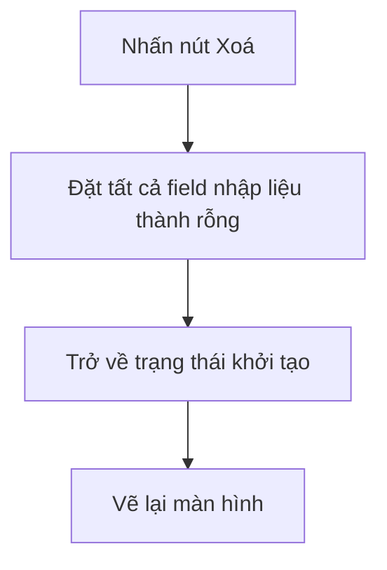
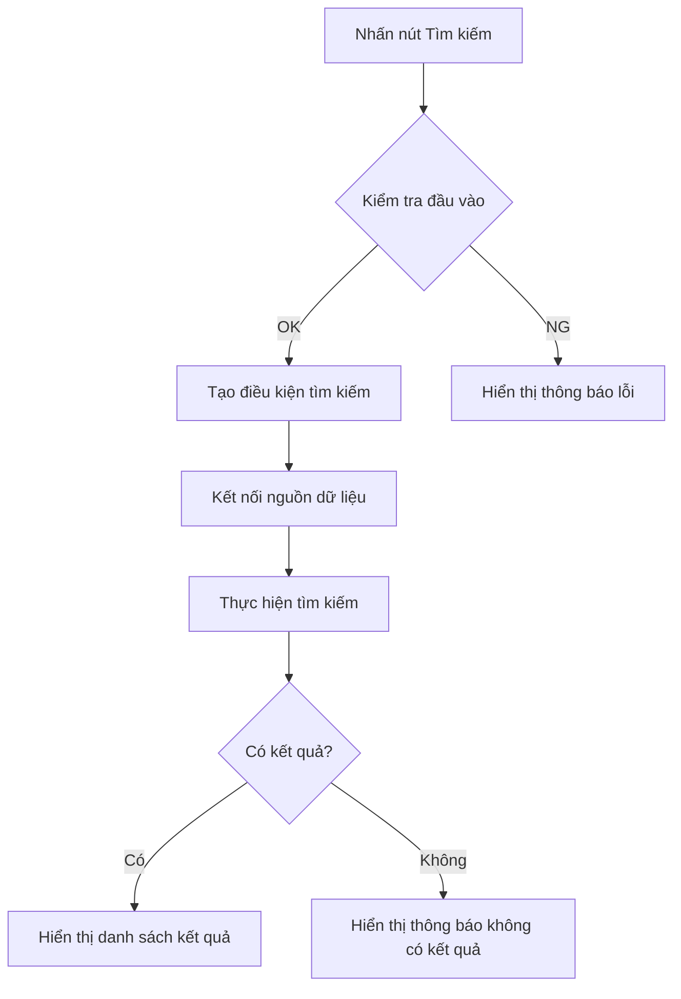

# 【Mẫu】Tài liệu thiết kế màn hình

## Thông tin cơ bản

| Mục                              | Nội dung                              |
| -------------------------------- | ------------------------------------- |
| **Màn hình ID**                  | `{ScreenID}`                          |
| **Tên màn hình**                 | `{Tên màn hình}`                      |
| **System ID**                    | `{SystemID}`                          |
| **Phiên bản**                    | v0.00                                 |
| **Ngày tạo**                     | `{YYYY-MM-DD}`                        |
| **Người tạo**                    | `{Tên người tạo}`                     |
| **Tài liệu thiết kế cơ bản gốc** | `{Tên file tài liệu thiết kế cơ bản}` |

---

## 1. Hiển thị khởi tạo

**Tóm tắt xử lý**: Xử lý hiển thị khởi đầu của màn hình `{Tên màn hình}`

### Danh sách phần tử hiển thị trên màn hình

| No. | Tên phần tử       | Tên vật lý        | Kiểu   | Số ký tự | Bắt buộc | Giá trị khởi tạo | Mô tả     |
| --- | ----------------- | ----------------- | ------ | -------- | -------- | ---------------- | --------- |
| 1   | `{Tên phần tử 1}` | `{physicalName1}` | string | `{N}`    | -        | ""               | `{Mô tả}` |
| 2   | `{Tên phần tử 2}` | `{physicalName2}` | string | `{N}`    | -        | ""               | `{Mô tả}` |
| 3   | `{Tên phần tử 3}` | `{physicalName3}` | string | `{N}`    | -        | ""               | `{Mô tả}` |

### Nguồn dữ liệu

- **Tên file**: `{Tên file logic}` (`{Tên file vật lý}`)
- **Định dạng**: `{XML / JSON / CSV / TSV}`
- **Bộ ký tự**: `{JIS X 0208 \| UTF-8 \| Khác}`
- **Encoding**: `{UTF-8 \| Shift-JIS \| Khác}`

---

## 2. Chỉ định điều kiện tìm kiếm tuỳ ý

**Tóm tắt xử lý**: Người dùng có thể tuỳ ý chỉ định điều kiện tìm kiếm

### Danh sách phần tử điều kiện tìm kiếm

| Tên tham số   | Tên logic               | Kiểu        | Bắt buộc | Lặp lại | Mô tả     |
| ------------- | ----------------------- | ----------- | -------- | ------- | --------- |
| `{param1}`    | `{Tên logic 1}`         | [JSON]Chuỗi | No       | No      | `{Mô tả}` |
| `{param2}`    | `{Tên logic 2}`         | [JSON]Chuỗi | No       | No      | `{Mô tả}` |
| `{listParam}` | `{Tên logic danh sách}` | [JSON]Mảng  | No       | 1..\*   | `{Mô tả}` |

---

## 3. Nhấn nút [Xoá]

**Tóm tắt xử lý**: Xoá toàn bộ điều kiện tìm kiếm

### Luồng xử lý

### Chi tiết xử lý

| No. | Nội dung xử lý                              | Ghi chú                   |
| --- | ------------------------------------------- | ------------------------- |
| 1   | Đặt tất cả field nhập liệu thành chuỗi rỗng | `{Liệt kê tên các field}` |
| 2   | Xoá danh sách kết quả tìm kiếm              | -                         |
| 3   | Xoá thông báo lỗi                           | -                         |

---

## 4. Nhấn nút [Tìm kiếm]

**Tóm tắt xử lý**: Tìm kiếm thông tin theo điều kiện đã nhập

### Luồng xử lý

### Danh sách kiểm tra đầu vào

| No. | Mục kiểm tra          | Điều kiện             | Thông báo lỗi       |
| --- | --------------------- | --------------------- | ------------------- |
| 1   | Số ký tự `{field1}`   | `{N}` ký tự trở xuống | `{Thông báo lỗi 1}` |
| 2   | Số ký tự `{field2}`   | `{N}` ký tự trở xuống | `{Thông báo lỗi 2}` |
| 3   | `{Mục kiểm tra khác}` | `{Điều kiện}`         | `{Thông báo lỗi}`   |

---

## 5. Nhấn nút Sắp xếp

**Tóm tắt xử lý**: Thay đổi thứ tự sắp xếp của kết quả tìm kiếm

### Các phần tử hỗ trợ sắp xếp

| No. | Tên phần tử       | Thứ tự sắp xếp    | Mặc định |
| --- | ----------------- | ----------------- | -------- |
| 1   | `{Tên phần tử 1}` | Tăng dần/Giảm dần | Tăng dần |
| 2   | `{Tên phần tử 2}` | Tăng dần/Giảm dần | -        |
| 3   | `{Tên phần tử 3}` | Tăng dần/Giảm dần | -        |

---

## 6. Điều khiển số lượng hiển thị

**Tóm tắt xử lý**: Điều khiển số bản ghi hiển thị mỗi trang

### Các lựa chọn số lượng hiển thị

| Giá trị | Mô tả                |
| ------- | -------------------- |
| 10      | Hiển thị 10 bản ghi  |
| 25      | Hiển thị 25 bản ghi  |
| 50      | Hiển thị 50 bản ghi  |
| 100     | Hiển thị 100 bản ghi |

---

## 7. Điều hướng trang

**Tóm tắt xử lý**: Chuyển trang kết quả tìm kiếm

### Chức năng điều hướng trang

| Chức năng   | Mô tả                               |
| ----------- | ----------------------------------- |
| Trang trước | Chuyển đến trang trước              |
| Trang sau   | Chuyển đến trang tiếp theo          |
| Số trang    | Chuyển trực tiếp đến trang chỉ định |

---

## 8. Kiểm tra từng phần tử

**Tóm tắt xử lý**: Kiểm tra từng phần tử nhập liệu riêng lẻ

### Danh sách kiểm tra

| Tên phần tử | Loại kiểm tra   | Điều kiện   | Thông báo lỗi                       |
| ----------- | --------------- | ----------- | ----------------------------------- |
| `{field1}`  | Kiểm tra kiểu   | [JSON]Chuỗi | Vui lòng nhập đúng định dạng        |
| `{field1}`  | Kiểm tra độ dài | Max `{N}`   | Vui lòng nhập `{N}` ký tự trở xuống |
| `{field2}`  | Kiểm tra kiểu   | [JSON]Chuỗi | Vui lòng nhập đúng định dạng        |
| `{field2}`  | Kiểm tra độ dài | Max `{N}`   | Vui lòng nhập `{N}` ký tự trở xuống |

---

## 9. Nhấn nút sắp xếp trên tiêu đề cột của danh sách kết quả

**Tóm tắt xử lý**: Sắp xếp theo cột cụ thể trong danh sách kết quả

### Danh sách phần tử hiển thị kết quả

| No. | Tên phần tử       | Tên vật lý        | Có thể sắp xếp | Mô tả     |
| --- | ----------------- | ----------------- | -------------- | --------- |
| 1   | `{Tên phần tử 1}` | `{physicalName1}` | ○              | `{Mô tả}` |
| 2   | `{Tên phần tử 2}` | `{physicalName2}` | ○              | `{Mô tả}` |
| 3   | `{Tên phần tử 3}` | `{physicalName3}` | ○              | `{Mô tả}` |
| 4   | `{Tên phần tử 4}` | `{physicalName4}` | -              | `{Mô tả}` |

---

## Thông tin định nghĩa file (từ Basic Design)

### Tài liệu định nghĩa file

| Mục                 | Nội dung                           |
| ------------------- | ---------------------------------- |
| **Tên file logic**  | `{Tên file logic}`                 |
| **Tên file vật lý** | `{Tên file vật lý}`                |
| **Thư mục lưu trữ** | `{Đường dẫn thư mục lưu trữ}`      |
| **Bộ ký tự**        | `{JIS X 0208 \| UTF-8 \| Khác}`    |
| **Encoding**        | `{UTF-8 \| Shift-JIS \| Khác}`     |
| **Định dạng**       | `{XML / JSON / CSV / TSV / Excel}` |

### Bảng hỗ trợ định dạng dữ liệu

| Kiểu XML   | Kiểu JSON | Kiểu CSV/TSV | Ký tự xuống dòng | Có header | Ghi chú |
| ---------- | --------- | ------------ | ---------------- | --------- | ------- |
| Kiểu logic | XML       | Kiểu logic   | CR+LF            | Có        | -       |
| Chuỗi      | JSON      | Chuỗi        | LF               | -         | -       |
| Số         | -         | Số           | CR               | -         | -       |
| Ngày/Giờ   | -         | Ngày         | Không có         | -         | -       |
| Boolean    | -         | Boolean      | -                | -         | -       |

---

## Tài liệu liên quan

- **Tài liệu thiết kế cơ bản**: `{Tài liệu tổng quan xử lý online_ID xử lý_Tên xử lý}`
- **Tài liệu thiết kế API**: `{Tài liệu thiết kế API_APIID_Tên API}`
- **Tài liệu thiết kế bảng**: `{Tài liệu thiết kế bảng_TABLE_Tên bảng}`
