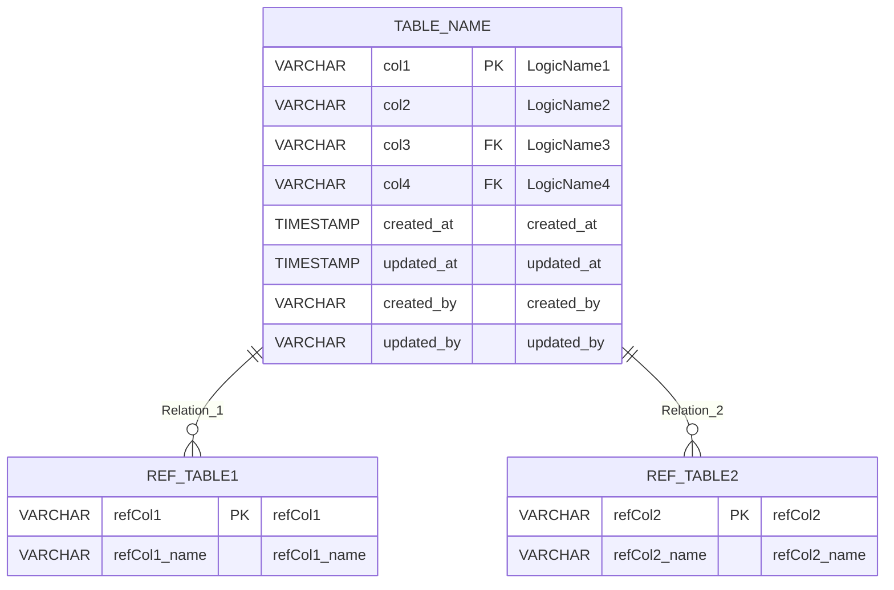

# 【Mẫu】Tài liệu thiết kế bảng

## Thông tin cơ bản

| Mục                              | Nội dung                              |
| -------------------------------- | ------------------------------------- |
| **Entity ID**                    | `{EntityID}`                          |
| **Tên Entity**                   | `{Tên bảng (logic)}`                  |
| **Tên bảng**                     | `{TABLE_NAME}`                        |
| **Master/Transaction**           | `{Master \| Transaction}`             |
| **Phiên bản**                    | v0.00                                 |
| **Ngày tạo**                     | `{YYYY-MM-DD}`                        |
| **Người tạo**                    | `{Tên người tạo}`                     |
| **Tài liệu thiết kế cơ bản gốc** | `{Tên file tài liệu thiết kế cơ bản}` |

---

## 1. Tổng quan bảng

### Định nghĩa bảng

| Mục                 | Nội dung                                  |
| ------------------- | ----------------------------------------- |
| **Tên file logic**  | `{Tên file logic}`                        |
| **Tên file vật lý** | `{Tên file vật lý}`                       |
| **Thư mục lưu trữ** | `{Đường dẫn thư mục}`                     |
| **Bộ ký tự**        | `{JIS X 0208 \| UTF-8 \| Khác}`           |
| **Encoding**        | `{UTF-8 \| Shift-JIS \| Khác}`            |
| **Khoá chính**      | `{columnName}` (`{Tên logic khoá chính}`) |

---

## 2. Định nghĩa cột

### Danh sách cột

| No. | Tên cột    | Tên logic       | Kiểu dữ liệu | Độ dài | NULL | Khoá chính | Khoá ngoại | Mặc định               | Mô tả                     |
| --- | ---------- | --------------- | ------------ | ------ | ---- | ---------- | ---------- | ---------------------- | ------------------------- |
| 1   | `{col1}`   | `{Tên logic 1}` | VARCHAR      | `{N}`  | NO   | PK         | -          | -                      | `{Mô tả}`                 |
| 2   | `{col2}`   | `{Tên logic 2}` | VARCHAR      | `{N}`  | YES  | -          | -          | -                      | `{Mô tả}`                 |
| 3   | `{col3}`   | `{Tên logic 3}` | VARCHAR      | `{N}`  | YES  | -          | FK         | `{REF_TABLE}.{refCol}` | `{Mô tả}`                 |
| 4   | `{col4}`   | `{Tên logic 4}` | VARCHAR      | `{N}`  | YES  | -          | -          | -                      | `{Mô tả}`                 |
| 5   | created_at | Ngày tạo        | TIMESTAMP    | -      | NO   | -          | -          | CURRENT_TIMESTAMP      | Ngày giờ tạo bản ghi      |
| 6   | updated_at | Ngày cập nhật   | TIMESTAMP    | -      | NO   | -          | -          | CURRENT_TIMESTAMP      | Ngày giờ cập nhật bản ghi |
| 7   | created_by | Người tạo       | VARCHAR      | 50     | YES  | -          | -          | -                      | Người tạo bản ghi         |
| 8   | updated_by | Người cập nhật  | VARCHAR      | 50     | YES  | -          | -          | -                      | Người cập nhật bản ghi    |

---

## 3. Định nghĩa Index

### Danh sách Index

| No. | Tên Index                    | Cột              | Loại       | Unique | Mô tả                                     |
| --- | ---------------------------- | ---------------- | ---------- | ------ | ----------------------------------------- |
| 1   | `PK_{TABLE_NAME}`            | `{col1}`         | Khoá chính | YES    | Index khoá chính `{Tên logic 1}`          |
| 2   | `IDX_{TABLE_NAME}_{suffix}`  | `{col2}`         | Tìm kiếm   | NO     | Index tìm kiếm theo `{Tên logic 2}`       |
| 3   | `IDX_{TABLE_NAME}_{suffix2}` | `{col3}, {col4}` | Tìm kiếm   | NO     | Index tổng hợp tìm kiếm theo `{mục đích}` |

---

## 4. Định nghĩa khoá ngoại

### Danh sách khoá ngoại

| No. | Tên ràng buộc               | Cột      | Bảng tham chiếu | Cột tham chiếu | Khi xoá  | Khi cập nhật |
| --- | --------------------------- | -------- | --------------- | -------------- | -------- | ------------ |
| 1   | `FK_{TABLE_NAME}_{suffix}`  | `{col3}` | `{REF_TABLE1}`  | `{refCol1}`    | SET NULL | CASCADE      |
| 2   | `FK_{TABLE_NAME}_{suffix2}` | `{col4}` | `{REF_TABLE2}`  | `{refCol2}`    | SET NULL | CASCADE      |

---

## 5. Định nghĩa định dạng dữ liệu (từ Basic Design)

### Bảng hỗ trợ định dạng dữ liệu

| Kiểu XML      | Kiểu JSON  | Kiểu CSV/TSV | Fixed-length    | Ghi chú                        |
| ------------- | ---------- | ------------ | --------------- | ------------------------------ |
| Kiểu logic    | Kiểu logic | Kiểu logic   | 1 byte          | Kiểu Boolean                   |
| [XML]Chuỗi    | Chuỗi      | Chuỗi        | Độ dài thay đổi | Khoá chính, điều kiện tìm kiếm |
| [XML]Số       | Số         | Số           | Số              | ID, số lượng                   |
| [XML]Ngày/Giờ | Ngày       | Ngày         | 14 bytes        | YYYYMMDDHHMMSS                 |
| [XML]Boolean  | Boolean    | Boolean      | 1 byte          | Phần tử flag                   |

### Ký tự xuống dòng & Encoding

| Mục                  | Giá trị hỗ trợ                  |
| -------------------- | ------------------------------- |
| **Encoding**         | `{UTF-8 \| Shift-JIS \| Khác}`  |
| **Ký tự xuống dòng** | `{CR+LF / LF / CR}`             |
| **Bộ ký tự**         | `{JIS X 0208 \| UTF-8 \| Khác}` |

---

## 6. Định nghĩa phần tử dữ liệu (từ Basic Design: Định nghĩa tham số)

### Chuyển đổi từ định nghĩa tham số

| STT | Tên phần tử (tên tham số) | Tên logic               | Ánh xạ cột              | Lặp lại | Bắt buộc | Ví dụ định dạng      |
| --- | ------------------------- | ----------------------- | ----------------------- | ------- | -------- | -------------------- |
| 1   | `{param1}`                | `{Tên logic 1}`         | `{col1}`                | No      | Yes      | `{ví dụ}`            |
| 2   | `{param2}`                | `{Tên logic 2}`         | `{col2}`                | No      | No       | `{ví dụ}`            |
| 3   | `{param3}`                | `{Tên logic 3}`         | `{col3}`                | No      | No       | `{ví dụ}`            |
| 4   | `{listParam}`             | `{Tên logic danh sách}` | ※Kiểu mảng (bảng riêng) | 1..\*   | No       | `["code1", "code2"]` |

### Chi tiết trường mô tả

| Cột      | Mô tả                    |
| -------- | ------------------------ |
| `{col1}` | `{Mô tả chi tiết cột 1}` |
| `{col2}` | `{Mô tả chi tiết cột 2}` |
| `{col3}` | `{Mô tả chi tiết cột 3}` |

---

## 7. Sơ đồ quan hệ bảng (ER Diagram)



---

## 8. Thao tác CRUD

### Danh sách thao tác

| Thao tác   | Mô tả                              | Màn hình sử dụng chính                  |
| ---------- | ---------------------------------- | --------------------------------------- |
| **SELECT** | Tìm kiếm `{Tên logic bảng}`        | `{Tài liệu thiết kế màn hình_ScreenID}` |
| **INSERT** | Đăng ký mới `{Tên logic bảng}`     | `{Màn hình đăng ký}`                    |
| **UPDATE** | Cập nhật `{Tên logic bảng}`        | `{Màn hình chỉnh sửa}`                  |
| **DELETE** | Xoá `{Tên logic bảng}` (xoá logic) | `{Màn hình xoá}`                        |

---

## 9. Ví dụ câu truy vấn SQL

### Câu truy vấn tìm kiếm

```sql
-- Tìm kiếm {Tên logic bảng} (tìm kiếm cơ bản)
SELECT
    {col1},
    {col2},
    {col3},
    {col4}
FROM {TABLE_NAME}
WHERE
    (:{param1} IS NULL OR {col1} = :{param1})
    AND (:{param2} IS NULL OR {col2} LIKE :{param2})
    AND (:{param3} IS NULL OR {col3} = :{param3})
ORDER BY {col1} ASC
LIMIT :pageSize OFFSET :offset;
```

### Câu truy vấn đăng ký

```sql
-- Đăng ký mới {Tên logic bảng}
INSERT INTO {TABLE_NAME} (
    {col1},
    {col2},
    {col3},
    {col4},
    created_at,
    updated_at,
    created_by,
    updated_by
) VALUES (
    :{col1},
    :{col2},
    :{col3},
    :{col4},
    CURRENT_TIMESTAMP,
    CURRENT_TIMESTAMP,
    :createdBy,
    :updatedBy
);
```

### Câu truy vấn cập nhật

```sql
-- Cập nhật {Tên logic bảng}
UPDATE {TABLE_NAME}
SET
    {col2} = :{col2},
    {col3} = :{col3},
    {col4} = :{col4},
    updated_at = CURRENT_TIMESTAMP,
    updated_by = :updatedBy
WHERE {col1} = :{col1};
```

---

## 10. Luồng xử lý (từ Basic Design)

### Luồng xử lý định nghĩa dữ liệu

```mermaid
flowchart TD
    START[Bắt đầu định nghĩa dữ liệu] --> DataDefinition[DataDefinition]
    DataDefinition --> VALIDATE{Xác thực dữ liệu}
    VALIDATE -->|OK| STORE[Lưu dữ liệu]
    VALIDATE -->|NG| ERROR[Xử lý lỗi]
    STORE --> EndDef[/DataDefinition]
    ERROR --> EndDef
    EndDef --> END[Kết thúc xử lý]
```

---

## Tài liệu liên quan

- **Tài liệu thiết kế cơ bản**: `{Tài liệu tổng quan xử lý online_ID xử lý_Tên xử lý}`
- **Tài liệu thiết kế màn hình**: `{Tài liệu thiết kế màn hình_ScreenID_Tên màn hình}`
- **Tài liệu thiết kế API**: `{Tài liệu thiết kế API_APIID_Tên API}`
- **Tài liệu thiết kế SQL**: `{Tài liệu thiết kế SQL_SQLID_Tên SQL}`

---

## Lịch sử thay đổi

| Phiên bản | Ngày           | Người thay đổi    | Nội dung thay đổi |
| --------- | -------------- | ----------------- | ----------------- |
| v0.00     | `{YYYY-MM-DD}` | `{Tên người tạo}` | Tạo bản đầu tiên  |
