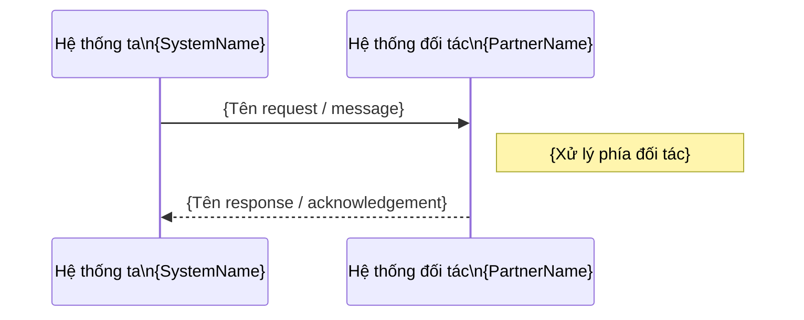

# Tài liệu Thiết kế Giao diện Ngoài — {Tên giao diện}

## Thông tin cơ bản

| Mục                  | Nội dung                      |
| -------------------- | ----------------------------- | ------ | ----------- | ------------ |
| **Interface ID**     | `{IF-NNN}`                    |
| **Tên giao diện**    | `{Tên giao diện}`             |
| **Hệ thống nội bộ**  | `{Tên hệ thống của chúng ta}` |
| **Hệ thống đối tác** | `{Tên hệ thống bên ngoài}`    |
| **Phiên bản**        | v0.00                         |
| **Ngày tạo**         | `{YYYY-MM-DD}`                |
| **Trạng thái**       | `{Draft                       | Agreed | Implemented | Deprecated}` |

---

## 1. Tổng quan Giao diện

| Mục               | Nội dung                                                    |
| ----------------- | ----------------------------------------------------------- |
| **Mục đích**      | `{Mô tả mục đích giao tiếp}`                                |
| **Hướng dữ liệu** | `{Chúng ta → Đối tác / Đối tác → Chúng ta / Hai chiều}`     |
| **Giao thức**     | `{REST API / SOAP / SFTP / MQ / TCP / File Exchange / ...}` |
| **Tần suất**      | `{Real-time / Batch hàng ngày / On-demand / ...}`           |
| **Môi trường**    | `{Dev / Staging / Production}`                              |

---

## 2. Sơ đồ Giao tiếp



---

## 3. Thông tin Kết nối

| Mục            | Dev                              | Staging      | Production    |
| -------------- | -------------------------------- | ------------ | ------------- |
| **Host / URL** | `{host-dev}`                     | `{host-stg}` | `{host-prod}` |
| **Port**       | `{port}`                         | `{port}`     | `{port}`      |
| **Giao thức**  | `{HTTP/HTTPS/SFTP/...}`          | -            | -             |
| **Xác thực**   | `{API Key / OAuth / mTLS / ...}` | -            | -             |
| **Timeout**    | `{N}s`                           | -            | -             |
| **Retry**      | `{N}` lần                        | -            | -             |

---

## 4. Định nghĩa Message / File

### Request (Chúng ta gửi đi)

| No. | Tên field  | Kiểu    | Bắt buộc | Mô tả     | Ví dụ       |
| --- | ---------- | ------- | -------- | --------- | ----------- |
| 1   | `{field1}` | string  | Yes      | `{Mô tả}` | `{example}` |
| 2   | `{field2}` | integer | No       | `{Mô tả}` | `{example}` |

```json
{
  "{field1}": "{example}",
  "{field2}": 0
}
```

### Response (Chúng ta nhận về)

| No. | Tên field  | Kiểu   | Mô tả     | Ví dụ       |
| --- | ---------- | ------ | --------- | ----------- |
| 1   | `{field1}` | string | `{Mô tả}` | `{example}` |
| 2   | `{field2}` | string | `{Mô tả}` | `{example}` |

---

## 5. Xử lý Lỗi

| Mã lỗi         | Mô tả                            | Hành động xử lý                       |
| -------------- | -------------------------------- | ------------------------------------- |
| `{ERR_CODE_1}` | `{Mô tả lỗi}`                    | `{Retry / Alert / Fallback / ...}`    |
| `{ERR_CODE_2}` | `{Mô tả lỗi}`                    | `{Xử lý}`                             |
| Timeout        | Không nhận response trong `{N}s` | `{Retry N lần → Alert}`               |
| Network error  | Mất kết nối                      | `{Enqueue & retry / Circuit breaker}` |

---

## 6. Bảo mật

| Mục                  | Nội dung                                      |
| -------------------- | --------------------------------------------- |
| **Xác thực**         | `{API Key / OAuth 2.0 / mTLS / IP whitelist}` |
| **Mã hoá**           | `{TLS 1.3 / Payload encryption}`              |
| **Dữ liệu nhạy cảm** | `{Masking / Tokenization}`                    |
| **Audit log**        | `{Ghi log toàn bộ request/response}`          |

---

## 7. SLA & Monitoring

| Mục               | Giá trị                                       |
| ----------------- | --------------------------------------------- |
| **Availability**  | `{99.9%}`                                     |
| **Response time** | `{< N ms}`                                    |
| **Alert khi**     | `{Error rate > N% / Latency > Nms / Timeout}` |

---

## Tài liệu liên quan

- **System Architecture**: `tpl_system_architecture.md`
- **API Spec (nếu có)**: `openapi_spec_{APIID}_{Name}_v{X.XX}.yaml`
- **Runbook**: `runbook_{system}.md`
