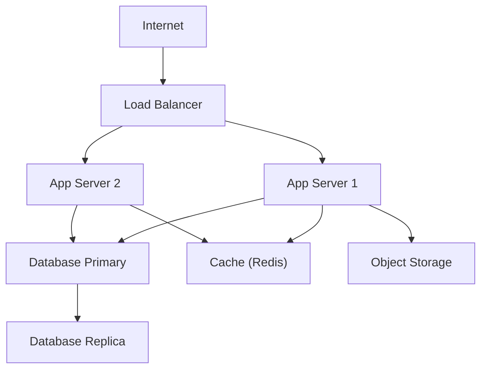
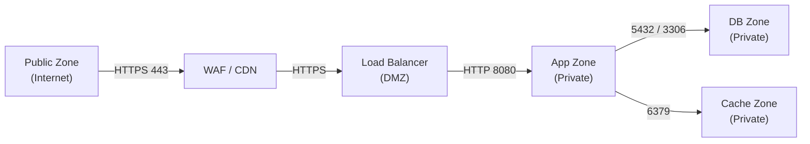

# Thiet ke Ha tang (Infrastructure Design) — {Ten he thong}

## Thong tin co ban

| Muc                | Noi dung       |
| ------------------ | -------------- | ------ | ---------- |
| **He thong**       | `{SystemName}` |
| **Phien ban**      | v0.00          |
| **Ngay tao**       | `{YYYY-MM-DD}` |
| **Nguoi thiet ke** | `{Ten}`        |
| **Nguoi duyet**    | `{Ten}`        |
| **Trang thai**     | `{Draft        | Review | Approved}` |

---

## 1. Tong quan kien truc ha tang

---

## 2. Danh sach moi truong

| Moi truong             | Muc dich          | URL / Endpoint | Ghi chu                            |
| ---------------------- | ----------------- | -------------- | ---------------------------------- |
| Development            | Phat trien noi bo | `{URL}`        |                                    |
| Staging                | Kiem thu UAT      | `{URL}`        | Tuong dong Production              |
| Production             | Chinh thuc        | `{URL}`        |                                    |
| DR (Disaster Recovery) | Du phong tham hoa | `{URL}`        | {Chien luoc: Active-Passive / ...} |

---

## 3. Thong so may chu (Server Specifications)

### 3.1 Application Servers

| Ten may chu    | Vai tro          | CPU        | RAM      | Storage      | OS                     | So luong        |
| -------------- | ---------------- | ---------- | -------- | ------------ | ---------------------- | --------------- |
| `app-server`   | API / App server | `{N}` vCPU | `{N}` GB | `{N}` GB SSD | `{Ubuntu 22.04 / ...}` | `{N}` instances |
| `batch-server` | Batch processing | `{N}` vCPU | `{N}` GB | `{N}` GB SSD | `{OS}`                 | `{N}`           |

### 3.2 Database Servers

| Ten may chu  | Vai tro            | CPU        | RAM      | Storage      | Engine                       | Version     |
| ------------ | ------------------ | ---------- | -------- | ------------ | ---------------------------- | ----------- |
| `db-primary` | Primary read/write | `{N}` vCPU | `{N}` GB | `{N}` GB SSD | `{PostgreSQL / MySQL / ...}` | `{version}` |
| `db-replica` | Read replica       | `{N}` vCPU | `{N}` GB | `{N}` GB SSD | `{Engine}`                   | `{version}` |

### 3.3 Cache / Queue

| Ten may chu    | Vai tro         | RAM      | Engine                     | Version     |
| -------------- | --------------- | -------- | -------------------------- | ----------- |
| `cache-server` | In-memory cache | `{N}` GB | `{Redis / Memcached}`      | `{version}` |
| `queue-server` | Message queue   | `{N}` GB | `{RabbitMQ / Kafka / SQS}` | `{version}` |

---

## 4. Mang (Network Topology)

### 4.1 So do mang

### 4.2 Cau hinh mang

| Component   | CIDR / IP       | Port | Protocol | Mo ta                         |
| ----------- | --------------- | ---- | -------- | ----------------------------- |
| Public ALB  | `{0.0.0.0/0}`   | 443  | HTTPS    | Tiep nhan traffic tu Internet |
| App Server  | `{10.0.1.0/24}` | 8080 | HTTP     | Internal only                 |
| DB Primary  | `{10.0.2.10}`   | 5432 | TCP      | DB Zone, App -> DB only       |
| Redis Cache | `{10.0.3.10}`   | 6379 | TCP      | App -> Cache only             |

---

## 5. Luu tru (Storage)

| Loai luu tru        | Su dung                    | Dung luong | Backup         | Mo ta                     |
| ------------------- | -------------------------- | ---------- | -------------- | ------------------------- |
| Block Storage (SSD) | OS, Application            | `{N}` GB   | Daily snapshot |                           |
| Object Storage      | User uploads, logs, backup | `{N}` TB   | Replication    | `{S3 / GCS / Azure Blob}` |
| NFS / File Share    | Shared files               | `{N}` GB   | `{N}`          |                           |

---

## 6. Backup & Recovery

| Doi tuong        | Tan suat backup | Luu giu (Retention) | Phuong phap                  | RTO         | RPO         |
| ---------------- | --------------- | ------------------- | ---------------------------- | ----------- | ----------- |
| Database         | Hang ngay       | 30 ngay             | pg_dump / automated snapshot | `{< N gio}` | `{< N gio}` |
| File Storage     | Hang ngay       | 14 ngay             | {Phuong phap}                | `{< N gio}` | `{< N gio}` |
| Config / Secrets | Theo commit     | Vinh vien           | Git / Secrets Manager        | -           | -           |

---

## 7. Cloud Resources (neu ap dung)

| Resource        | Provider              | Service                       | Region     | Loai / Tier       | Ghi chu |
| --------------- | --------------------- | ----------------------------- | ---------- | ----------------- | ------- |
| Compute         | `{AWS / GCP / Azure}` | `{EC2 / GCE / VM}`            | `{region}` | `{instance type}` |         |
| Database        | `{Provider}`          | `{RDS / CloudSQL / Azure DB}` | `{region}` | `{tier}`          |         |
| Cache           | `{Provider}`          | `{ElastiCache / ...}`         | `{region}` | `{tier}`          |         |
| Object Storage  | `{Provider}`          | `{S3 / GCS / Blob}`           | `{region}` | Standard          |         |
| CDN             | `{Provider}`          | `{CloudFront / ...}`          | Global     |                   |         |
| Secrets Manager | `{Provider}`          | `{AWS SM / GCP SM}`           | `{region}` |                   |         |

---

## 8. Ma tran moi truong

| Component  | Development | Staging     | Production        | DR         |
| ---------- | ----------- | ----------- | ----------------- | ---------- |
| App Server | 1 instance  | 1 instance  | 2+ instances      | 1 instance |
| DB         | Single node | Single node | Primary + Replica | Replica    |
| Cache      | Shared      | Shared      | Dedicated         | Dedicated  |
| CDN        | Khong       | Co          | Co                | Co         |
| WAF        | Khong       | Co          | Co                | Co         |

---

## Lich su thay doi

| Phien ban | Ngay           | Nguoi   | Noi dung         |
| --------- | -------------- | ------- | ---------------- |
| v0.00     | `{YYYY-MM-DD}` | `{Ten}` | Tao ban dau tien |
