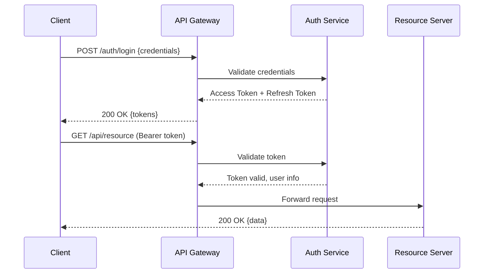

# Thiet ke Bao mat (Security Design) — {Ten he thong}

## Thong tin co ban

| Muc                | Noi dung       |
| ------------------ | -------------- | ------ | ---------- |
| **He thong**       | `{SystemName}` |
| **Phien ban**      | v0.00          |
| **Ngay tao**       | `{YYYY-MM-DD}` |
| **Nguoi thiet ke** | `{Ten}`        |
| **Nguoi duyet**    | `{Ten}`        |
| **Trang thai**     | `{Draft        | Review | Approved}` |

---

## 1. Xac thuc & Phan quyen (Authentication & Authorization)

### 1.1 Co che xac thuc

| Kenh truy cap | Phuong phap                             | Token / Session     | Han su dung | Ghi chu |
| ------------- | --------------------------------------- | ------------------- | ----------- | ------- |
| Web UI        | `{OAuth 2.0 / SAML / Local Session}`    | JWT                 | `{N}` phut  |         |
| Mobile App    | `{OAuth 2.0 / API Key}`                 | JWT + Refresh Token | `{N}` ngay  |         |
| API (B2B)     | `{API Key / OAuth2 Client Credentials}` | Access Token        | `{N}` gio   |         |
| Admin console | `{SSO / MFA bat buoc}`                  | Session             | `{N}` phut  |         |

**Luong xac thuc:**

### 1.2 Mo hinh phan quyen (RBAC)

| Role       | Mo ta              | Quyen                            |
| ---------- | ------------------ | -------------------------------- |
| `ADMIN`    | Quan tri he thong  | Toan quyen                       |
| `MANAGER`  | Quan ly du lieu    | Xem + Sua + Xoa (trong pham vi)  |
| `USER`     | Nguoi dung cuoi    | Xem + Sua (du lieu cua ban than) |
| `READONLY` | Doc bao cao        | Chi xem                          |
| `SERVICE`  | Service-to-service | API cu the duoc cap phep         |

**Ma tran quyen (tung resource):**

| Resource / Action          | ADMIN | MANAGER | USER    | READONLY |
| -------------------------- | ----- | ------- | ------- | -------- |
| GET /api/employees         | R     | R       | R       | R        |
| POST /api/employees        | C     | C       | -       | -        |
| PUT /api/employees/{id}    | U     | U       | U (own) | -        |
| DELETE /api/employees/{id} | D     | D       | -       | -        |

(R=Read, C=Create, U=Update, D=Delete)

---

## 2. Phan loai du lieu (Data Classification)

| Loai du lieu          | Vi du                       | Muc do nhay cam | Xu ly                                 |
| --------------------- | --------------------------- | --------------- | ------------------------------------- |
| Cong khai (Public)    | Ten san pham, gia           | Thap            | Khong can bao ve dac biet             |
| Noi bo (Internal)     | Thong tin nhan vien, luong  | Cao             | Ma hoa, kiem soat truy cap            |
| Bi mat (Confidential) | Mat khau, API key           | Rat cao         | Ma hoa + Audit log + MFA              |
| Cam (Restricted)      | Du lieu suc khoe, tai chinh | Cao nhat        | Ma hoa + Role strict + Logging day du |

---

## 3. Ma hoa (Encryption)

### 3.1 Ma hoa truyen thong (In Transit)

| Kenh                           | Giao thuc | Phien ban toi thieu   | Ghi chu               |
| ------------------------------ | --------- | --------------------- | --------------------- |
| Client <-> API Gateway         | TLS       | 1.2 (khuyen nghi 1.3) | Certificate tu `{CA}` |
| Service <-> Service (internal) | TLS       | 1.2                   | mTLS neu co the       |
| App <-> Database               | TLS       | 1.2                   |                       |

### 3.2 Ma hoa luu tru (At Rest)

| Loai luu tru          | Thuat toan                  | Quan ly key                             | Ghi chu                     |
| --------------------- | --------------------------- | --------------------------------------- | --------------------------- |
| Database (PII fields) | AES-256                     | `{AWS KMS / GCP KMS / HashiCorp Vault}` | Ma hoa tung truong nhay cam |
| Object Storage        | AES-256                     | Managed key                             | Server-side encryption      |
| Backup                | AES-256                     | Customer-managed key                    |                             |
| Secrets / Credentials | `{Vault / Secrets Manager}` | Rotation tu dong                        |                             |

---

## 4. Quan ly Bi mat (Secrets Management)

| Loai bi mat            | Luu tru                     | Rotation                | Scope           |
| ---------------------- | --------------------------- | ----------------------- | --------------- |
| Database credentials   | `{Secrets Manager / Vault}` | `{N}` ngay              | Per environment |
| API keys (third-party) | `{Secrets Manager}`         | Thu cong neu het han    | Per environment |
| JWT signing key        | `{Secrets Manager}`         | `{N}` ngay              | Per environment |
| TLS certificates       | `{Cert Manager / ACM}`      | Tu dong (Let's Encrypt) |                 |

**Quy tac:**

- Khong cung cap bi mat trong source code
- Khong commit bi mat len Git (kiem tra bang pre-commit hook)
- Moi moi truong co secret rieng biet

---

## 5. Kiem soat truy cap mang (Network Security)

| Layer         | Bien phap                      | Mo ta                                         |
| ------------- | ------------------------------ | --------------------------------------------- |
| CDN / Edge    | WAF (Web Application Firewall) | Chong OWASP Top 10, DDoS                      |
| Load Balancer | Security Group / Firewall Rule | Chi cho phep port 443 tu Internet             |
| App Server    | Security Group                 | Chi nhan tu LB (port 8080), khong mo Internet |
| Database      | Security Group                 | Chi nhan tu App Server (port 5432 / 3306)     |
| Admin Access  | VPN + MFA bat buoc             | Khong VPN khong vao duoc private zone         |

---

## 6. Audit Logging

| Su kien                       | Log level | Luu giu | Ghi chu                                    |
| ----------------------------- | --------- | ------- | ------------------------------------------ |
| Dang nhap thanh cong          | INFO      | 90 ngay | IP, user-agent, timestamp                  |
| Dang nhap that bai            | WARN      | 90 ngay | Dem lan that bai, khoa tai khoan sau N lan |
| Thay doi du lieu nhay cam     | AUDIT     | 1 nam   | Ai thay doi gi, gia tri truoc/sau          |
| Xoa du lieu                   | AUDIT     | 1 nam   |                                            |
| Truy cap tai nguyen cam       | WARN      | 90 ngay |                                            |
| Thay doi cau hinh, phan quyen | AUDIT     | 1 nam   |                                            |

---

## 7. Mo hinh Moi de doa (Threat Model)

### STRIDE Analysis

| Moi de doa                                | Mo ta                                  | Bien phap giam thieu                      |
| ----------------------------------------- | -------------------------------------- | ----------------------------------------- |
| **Spoofing** (Gia mao danh tinh)          | Ke tan cong gia mao nguoi dung         | MFA, OAuth2, token validation ketat       |
| **Tampering** (Gia mao du lieu)           | Sua doi request / response             | HTTPS, input validation, HMAC             |
| **Repudiation** (Phu nhan hanh vi)        | Nguoi dung phu nhan hanh dong cua minh | Audit log khong the xoa/sua               |
| **Information Disclosure** (Lo thong tin) | Du lieu nhay cam bi ro ri              | Ma hoa, masking, RBAC                     |
| **Denial of Service**                     | Lam qua tai he thong                   | Rate limiting, WAF, auto-scaling          |
| **Elevation of Privilege**                | Chiem quyen cao hon quyen bi cap       | Least privilege, RBAC strict, token scope |

---

## 8. Kiem tra Bao mat (Security Testing)

| Loai kiem tra               | Cong cu / Phuong phap               | Tan suat          | Nguoi thuc hien |
| --------------------------- | ----------------------------------- | ----------------- | --------------- |
| Static code analysis (SAST) | `{SonarQube / Semgrep / Checkmarx}` | Moi PR            | CI/CD tu dong   |
| Dependency scan             | `{OWASP Dependency-Check / Snyk}`   | Moi build         | CI/CD tu dong   |
| DAST (Dynamic scan)         | `{OWASP ZAP / Burp Suite}`          | Truoc moi release | Security team   |
| Penetration testing         | Thu cong boi external               | `{N}` lan/nam     | External vendor |
| Secret scanning             | `{git-secrets / truffleHog}`        | Moi commit        | CI/CD tu dong   |

---

## Lich su thay doi

| Phien ban | Ngay           | Nguoi   | Noi dung         |
| --------- | -------------- | ------- | ---------------- |
| v0.00     | `{YYYY-MM-DD}` | `{Ten}` | Tao ban dau tien |
