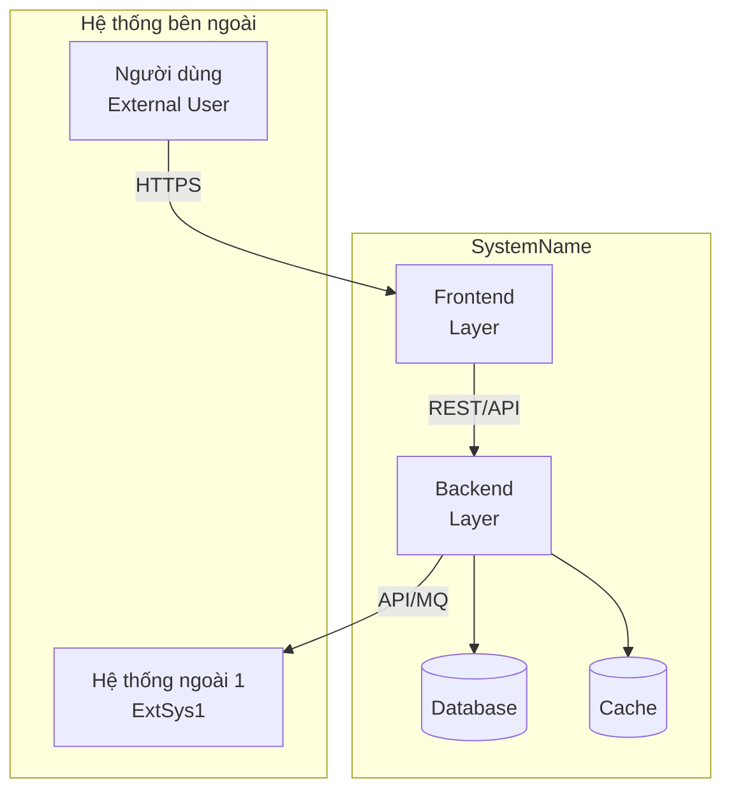
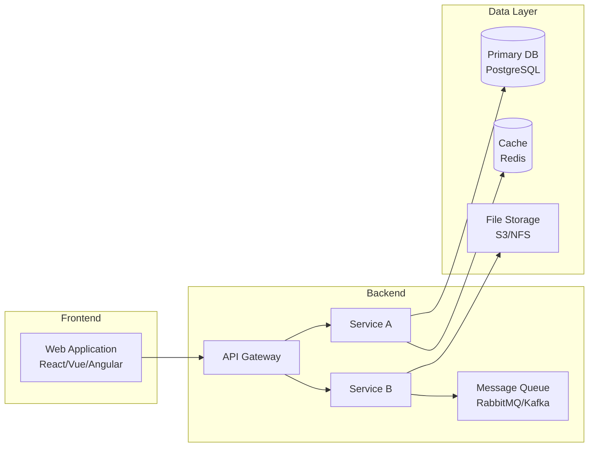
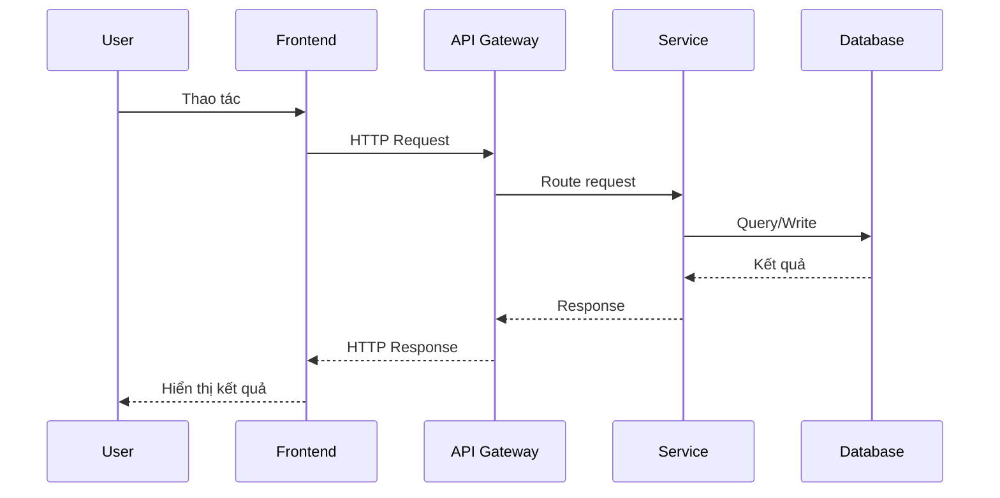

# Tài liệu Thiết kế Kiến trúc Hệ thống — {Tên hệ thống}

## Thông tin cơ bản

| Mục            | Nội dung       |
| -------------- | -------------- | ------ | ---------- |
| **Hệ thống**   | `{SystemName}` |
| **Phiên bản**  | v0.00          |
| **Ngày tạo**   | `{YYYY-MM-DD}` |
| **Tác giả**    | `{Tên}`        |
| **Trạng thái** | `{Draft        | Review | Approved}` |

---

## 1. Mục tiêu & Ràng buộc

### Mục tiêu thiết kế

- {Mục tiêu 1: ví dụ scalability, maintainability}
- {Mục tiêu 2}

### Ràng buộc kỹ thuật

- {Ràng buộc 1: ví dụ phải chạy trên Windows Server}
- {Ràng buộc 2}

### Non-Functional Requirements tóm tắt

| Loại                 | Yêu cầu                                             |
| -------------------- | --------------------------------------------------- |
| **Hiệu năng**        | `{ví dụ: response < 200ms, 99.9% uptime}`           |
| **Bảo mật**          | `{ví dụ: TLS 1.3, OAuth 2.0}`                       |
| **Khả năng mở rộng** | `{ví dụ: horizontal scaling, 10k concurrent users}` |
| **Độ sẵn sàng**      | `{ví dụ: 99.9%, RPO < 1h, RTO < 4h}`                |

---

## 2. Sơ đồ Kiến trúc Tổng thể (C4 Level 1 — Context)

---

## 3. Sơ đồ Component (C4 Level 2 — Container)

---

## 4. Technology Stack

| Layer          | Technology                                | Phiên bản   | Lý do chọn |
| -------------- | ----------------------------------------- | ----------- | ---------- |
| Frontend       | `{React / Vue / Angular / ...}`           | `{version}` | `{lý do}`  |
| Backend        | `{Java / Python / Node.js / ...}`         | `{version}` | `{lý do}`  |
| Framework      | `{Spring Boot / FastAPI / Express / ...}` | `{version}` | `{lý do}`  |
| Database       | `{PostgreSQL / MySQL / Oracle / ...}`     | `{version}` | `{lý do}`  |
| Cache          | `{Redis / Memcached / ...}`               | `{version}` | `{lý do}`  |
| Message Queue  | `{Kafka / RabbitMQ / ...}`                | `{version}` | `{lý do}`  |
| Infrastructure | `{AWS / Azure / GCP / On-prem}`           | -           | `{lý do}`  |
| CI/CD          | `{GitHub Actions / Jenkins / ...}`        | `{version}` | `{lý do}`  |

---

## 5. Mô tả các Component chính

### {ComponentA}

- **Trách nhiệm**: {Mô tả trách nhiệm}
- **Công nghệ**: {Tech stack}
- **Giao tiếp**: {REST / gRPC / IPC / MQ / ...} với {ComponentB}
- **Scale**: {Horizontal / Vertical / Fixed}

### {ComponentB}

- **Trách nhiệm**: {Mô tả trách nhiệm}
- **Công nghệ**: {Tech stack}
- **Giao tiếp**: {REST / gRPC / IPC / MQ / ...} với {ComponentA}
- **Scale**: {Horizontal / Vertical / Fixed}

---

## 6. Luồng dữ liệu chính (Data Flow)

---

## 7. Thiết kế Bảo mật (Security Overview)

| Lớp              | Biện pháp                             |
| ---------------- | ------------------------------------- |
| **Xác thực**     | `{OAuth 2.0 / JWT / Session / ...}`   |
| **Phân quyền**   | `{RBAC / ABAC / ACL}`                 |
| **Truyền thông** | `{TLS 1.3 / mTLS}`                    |
| **Dữ liệu tĩnh** | `{AES-256 / Transparent Encryption}`  |
| **Bí mật**       | `{Vault / AWS Secrets Manager / ...}` |
| **Logging**      | `{Access log, Audit log, Error log}`  |

---

## 8. Thiết kế Infra (Infrastructure Overview)

| Môi trường  | Mô tả     | URL/Host |
| ----------- | --------- | -------- |
| Development | `{Mô tả}` | `{host}` |
| Staging     | `{Mô tả}` | `{host}` |
| Production  | `{Mô tả}` | `{host}` |

---

## 9. Các quyết định kiến trúc quan trọng (ADR Summary)

| ADR     | Tiêu đề                  | Trạng thái |
| ------- | ------------------------ | ---------- |
| ADR-001 | `{Tiêu đề quyết định 1}` | Accepted   |
| ADR-002 | `{Tiêu đề quyết định 2}` | Accepted   |

→ Chi tiết xem `tpl_adr.md`

---

## Tài liệu liên quan

- **Use Case**: `usecases_list_{ModuleID}.md`
- **External Interface**: `external_interface_design_{ID}.md`
- **Infrastructure Design**: `infra_design_{env}.md`
- **Security Design**: `security_design_v{X.XX}.md`

---

## Lịch sử thay đổi

| Phiên bản | Ngày           | Người   | Nội dung         |
| --------- | -------------- | ------- | ---------------- |
| v0.00     | `{YYYY-MM-DD}` | `{Tên}` | Tạo bản đầu tiên |
