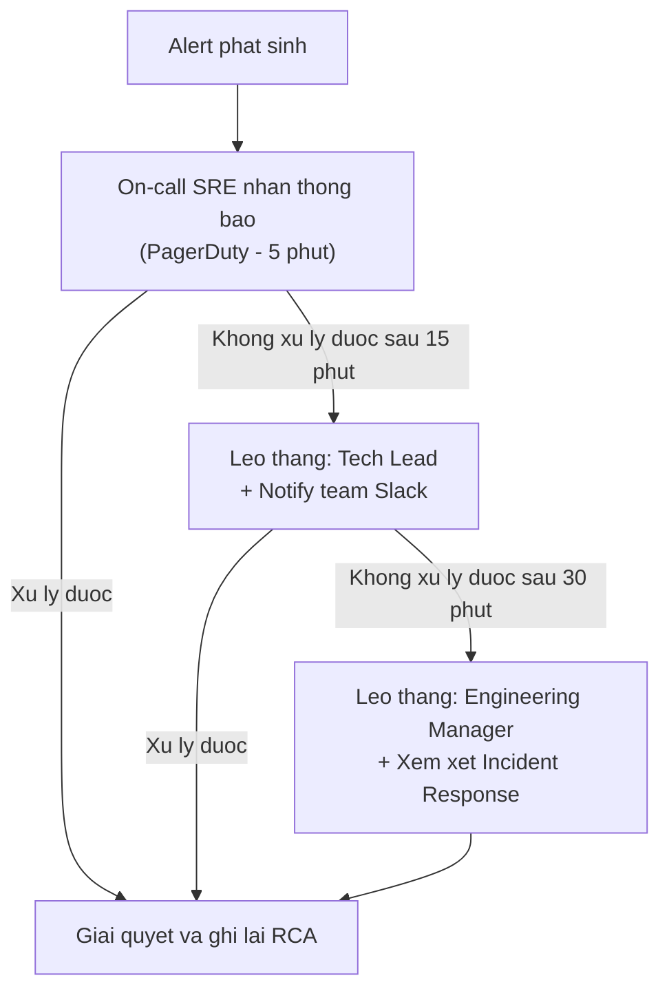

# Dac ta Giam sat & Canh bao (Monitoring & Alert Specification) — {Ten he thong}

## Thong tin co ban

| Muc                  | Noi dung                                                  |
| -------------------- | --------------------------------------------------------- |
| **He thong**         | `{SystemName}`                                            |
| **Phien ban**        | v0.00                                                     |
| **Ngay tao**         | `{YYYY-MM-DD}`                                            |
| **Nguoi tao**        | `{Ten}`                                                   |
| **Nguoi duyet**      | `{Ten}`                                                   |
| **Cong cu giam sat** | `{Datadog / Prometheus+Grafana / New Relic / CloudWatch}` |
| **Cong cu canh bao** | `{PagerDuty / OpsGenie / Slack webhook / Email}`          |

---

## 1. Cac chi so giam sat (Metrics)

### 1.1 Infrastructure Metrics

| Metric             | Nguon            | Mo ta                  | Don vi |
| ------------------ | ---------------- | ---------------------- | ------ |
| CPU Utilization    | Host / Container | Ty le su dung CPU      | %      |
| Memory Utilization | Host / Container | Ty le su dung RAM      | %      |
| Disk Utilization   | Host             | Ty le su dung dia cung | %      |
| Network I/O        | Host             | Luong du lieu vao/ra   | MB/s   |
| Disk I/O           | Host             | IOPS                   | ops/s  |

### 1.2 Application Metrics

| Metric             | Nguon             | Mo ta                            | Don vi  |
| ------------------ | ----------------- | -------------------------------- | ------- |
| Request Rate       | API Gateway / App | So request moi giay              | req/s   |
| Error Rate         | App / Log         | Ty le request loi (4xx, 5xx)     | %       |
| Response Time P50  | App               | Thoi gian phan hoi trung binh    | ms      |
| Response Time P95  | App               | 95th percentile response time    | ms      |
| Response Time P99  | App               | 99th percentile response time    | ms      |
| Active Connections | App Server        | So ket noi hien tai              | count   |
| Queue Size         | Message Queue     | So message trong queue cho xu ly | count   |
| Batch Job Duration | Batch             | Thoi gian chay batch             | s / min |

### 1.3 Database Metrics

| Metric                | Nguon      | Mo ta                         | Don vi  |
| --------------------- | ---------- | ----------------------------- | ------- |
| Connection Pool Usage | DB / App   | Ty le pool da su dung         | %       |
| Query Time            | DB         | Thoi gian truy van trung binh | ms      |
| Slow Query Count      | DB         | So query cham (> threshold)   | count   |
| Replication Lag       | DB Replica | Do tre dong bo Replica        | s       |
| Transaction Rate      | DB         | So transaction moi giay       | tx/s    |
| Table Size Growth     | DB         | Tang truong kich thuoc bang   | MB/ngay |

### 1.4 Business Metrics

| Metric                       | Nguon          | Mo ta                         | Don vi     |
| ---------------------------- | -------------- | ----------------------------- | ---------- |
| `{Success Transaction Rate}` | `{App}`        | `{Mo ta}`                     | `{Don vi}` |
| `{Active Users}`             | `{App / Auth}` | `{So nguoi dung dang online}` | count      |
| `{Failed Login Attempts}`    | `{Auth}`       | `{So lan dang nhap that bai}` | count      |

---

## 2. Quy tac Canh bao (Alert Rules)

### Infrastructure Alerts

| Alert          | Metric             | Dieu kien | Cua so thoi gian | Severity | Kenh      | Nguoi nhan  |
| -------------- | ------------------ | --------- | ---------------- | -------- | --------- | ----------- |
| High CPU       | CPU Utilization    | > 85%     | 5 phut lien tuc  | Warning  | Slack     | #ops-alerts |
| Critical CPU   | CPU Utilization    | > 95%     | 2 phut lien tuc  | Critical | PagerDuty | On-call SRE |
| High Memory    | Memory Utilization | > 90%     | 5 phut lien tuc  | Warning  | Slack     | #ops-alerts |
| Low Disk Space | Disk Utilization   | > 80%     | -                | Warning  | Email     | DevOps team |
| Critical Disk  | Disk Utilization   | > 95%     | -                | Critical | PagerDuty | On-call SRE |

### Application Alerts

| Alert               | Metric            | Dieu kien            | Cua so thoi gian | Severity | Kenh      | Nguoi nhan  |
| ------------------- | ----------------- | -------------------- | ---------------- | -------- | --------- | ----------- |
| High Error Rate     | Error Rate (5xx)  | > 1%                 | 5 phut           | Warning  | Slack     | #ops-alerts |
| Critical Error Rate | Error Rate (5xx)  | > 5%                 | 2 phut           | Critical | PagerDuty | On-call SRE |
| Slow Response       | Response Time P95 | > 1000ms             | 5 phut           | Warning  | Slack     | #ops-alerts |
| Very Slow Response  | Response Time P95 | > 3000ms             | 2 phut           | Critical | PagerDuty | On-call SRE |
| Service Down        | Health Check      | FAIL 3 lan lien tiep | -                | Critical | PagerDuty | On-call SRE |
| High Queue Size     | Queue Size        | > 1000               | 10 phut          | Warning  | Slack     | #dev-alerts |

### Database Alerts

| Alert                | Metric           | Dieu kien   | Cua so thoi gian | Severity | Kenh      | Nguoi nhan  |
| -------------------- | ---------------- | ----------- | ---------------- | -------- | --------- | ----------- |
| Connection Pool Full | Pool Usage       | > 90%       | 2 phut           | Critical | PagerDuty | On-call SRE |
| Replication Lag      | Replication Lag  | > 30s       | 5 phut           | Warning  | Slack     | #ops-alerts |
| Slow Queries         | Slow Query Count | > 10 / phut | 5 phut           | Warning  | Slack     | #dev-alerts |

### Business / Security Alerts

| Alert               | Metric                | Dieu kien                  | Severity | Kenh          | Nguoi nhan     |
| ------------------- | --------------------- | -------------------------- | -------- | ------------- | -------------- |
| Failed Login Spike  | Failed Login Attempts | > {N} lan / 5 phut tu 1 IP | High     | Slack + Email | Security team  |
| Unauthorized Access | 401/403 spike         | > {N}% trong 5 phut        | High     | Slack         | Security + Dev |

---

## 3. Quy trinh Leo thang (Escalation)

| Muc                      | Dieu kien                             | Nguoi nhan                  | Kenh                |
| ------------------------ | ------------------------------------- | --------------------------- | ------------------- |
| L1 — On-call SRE         | Alert khoi phat                       | On-call SRE                 | PagerDuty           |
| L2 — Tech Lead           | Chua xu ly sau 15 phut, hoac Critical | Tech Lead                   | PagerDuty + Phone   |
| L3 — Engineering Manager | Chua xu ly sau 30 phut                | EM                          | Phone               |
| Khach hang               | Downtime > 30 phut tren Production    | Support team bao khach hang | Email / Status page |

---

## 4. Health Check Endpoints

| Service    | Endpoint        | Method              | Expected Response         | Mo ta                          |
| ---------- | --------------- | ------------------- | ------------------------- | ------------------------------ |
| API Server | `/health`       | GET                 | `200 {"status": "ok"}`    | Kiem tra service con song      |
| API Server | `/health/ready` | GET                 | `200 {"status": "ready"}` | Kiem tra san sang nhan traffic |
| Database   | -               | TCP connect to port | Connection established    | DB con hoat dong               |
| Cache      | -               | PING                | PONG                      | Cache con hoat dong            |

---

## 5. Dashboard

| Dashboard       | Cong cu               | URL     | Mo ta                                 | Nguoi xem      |
| --------------- | --------------------- | ------- | ------------------------------------- | -------------- |
| System Overview | `{Grafana / Datadog}` | `{URL}` | Tong quan ha tang va app              | DevOps, Dev    |
| API Performance | `{Grafana / Datadog}` | `{URL}` | Response time, error rate, throughput | Dev, QA        |
| Database        | `{Grafana / Datadog}` | `{URL}` | Query perf, connections, replication  | Dev, DBA       |
| Business KPI    | `{Grafana / Datadog}` | `{URL}` | Business metrics                      | PO, Management |
| Security Events | `{SIEM / Datadog}`    | `{URL}` | Audit log, failed logins, anomaly     | Security       |

---

## Lich su thay doi

| Phien ban | Ngay           | Nguoi   | Noi dung         |
| --------- | -------------- | ------- | ---------------- |
| v0.00     | `{YYYY-MM-DD}` | `{Ten}` | Tao ban dau tien |
