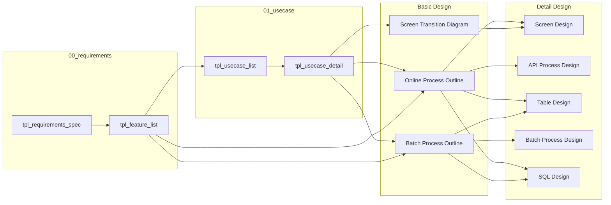
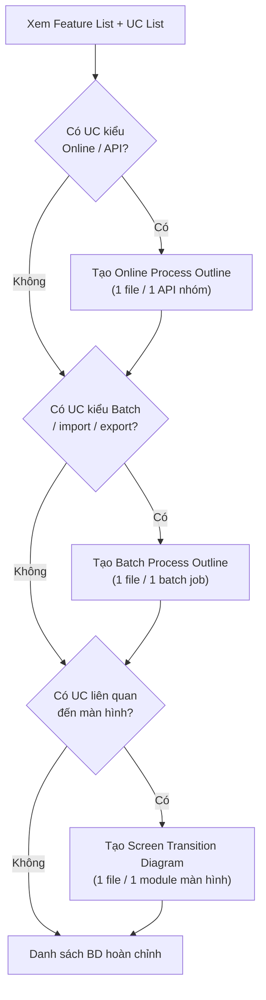
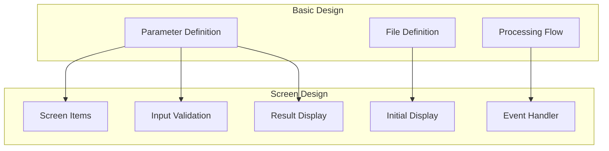
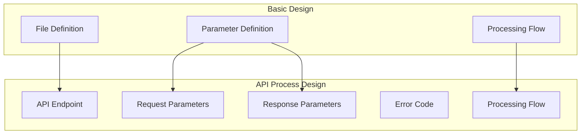
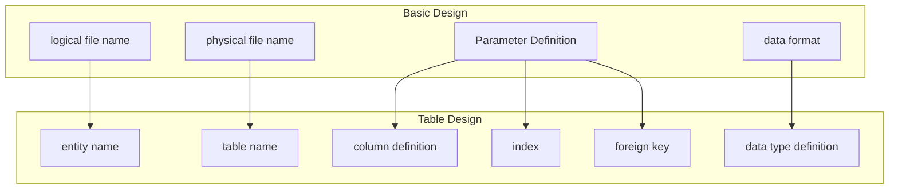
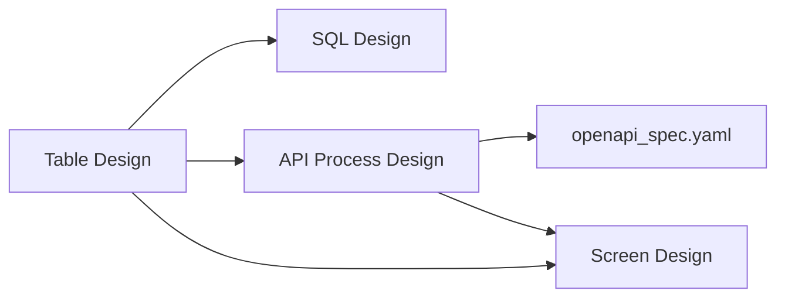

# Workflow: Hướng Dẫn Tạo Tài Liệu Dự Án — Template → Basic Design → Detail Design

## Tổng quan

Tài liệu này là hướng dẫn thực hành để hệ thống hóa quy trình đầy đủ **từ Template chuẩn qua Basic Design đến Detail Design**.

Quy trình gồm 3 phase chính:

```mermaid
flowchart LR
    subgraph P1["Phase 1 — Requirements & Use Case"]
        T1[tpl_requirements_spec]
        T2[tpl_feature_list]
        T3[tpl_usecase_list]
        T4[tpl_usecase_detail]
    end

    subgraph P2["Phase 2 — Basic Design"]
        BD1[Online Process Outline]
        BD2[Batch Process Outline]
        BD3[Screen Transition Diagram]
    end

    subgraph P3["Phase 3 — Detail Design"]
        DD1[Screen Design]
        DD2[API Process Design]
        DD3[Table Design]
        DD4[Batch Process Design]
        DD5[SQL Design]
    end

    P1 --> P2 --> P3
```



---

## 1. Phân loại tài liệu và mối quan hệ

### 1.1 Template đầu vào (00_requirements & 01_usecase)

| Template                   | Mục đích                                   | Đầu ra                                |
| -------------------------- | ------------------------------------------ | ------------------------------------- |
| `tpl_requirements_spec.md` | Đặc tả yêu cầu chức năng + phi chức năng   | Danh sách tính năng, ràng buộc, AC    |
| `tpl_feature_list.md`      | Catalogue tính năng theo module             | Danh sách feature có priority         |
| `tpl_usecase_list.md`      | Tổng hợp UC toàn module                    | Danh sách UC, actor, entry point      |
| `tpl_usecase_detail.md`    | Chi tiết từng UC                           | Main/alt/error flow, sequence diagram |

### 1.2 Basic Design (đầu ra Phase 2 / đầu vào Phase 3)

| Basic Design                  | Tên tiếng Anh             | Nội dung                             | Nguồn từ template             |
| ----------------------------- | ------------------------- | ------------------------------------ | ----------------------------- |
| **Online Process Outline**    | Online Process Outline    | Tổng quan xử lý hệ thống trực tuyến  | UC online + Feature list      |
| **Batch Process Outline**     | Batch Process Outline     | Tổng quan xử lý batch                | UC batch + Feature list       |
| **Screen Transition Diagram** | Screen Transition Diagram | Sơ đồ chuyển đổi giữa các màn hình   | UC flow màn hình + Wireframe  |

### 1.3 Detail Design (đầu ra Phase 3)

| Detail Design            | Tên tiếng Anh        | Nguồn từ Basic Design                              |
| ------------------------ | -------------------- | -------------------------------------------------- |
| **Screen Design**        | Screen Design        | Online Process Outline + Screen Transition Diagram |
| **API Process Design**   | API Process Design   | Online Process Outline                             |
| **Table Design**         | Table Design         | Online Process Outline + Batch Process Outline     |
| **Batch Process Design** | Batch Process Design | Batch Process Outline                              |
| **SQL Design**           | SQL Design           | Online Process Outline + Batch Process Outline     |

### 1.4 Ma trận chuyển đổi toàn luồng



---

## 2. Phase 1 — Thu thập yêu cầu & Phân tích Use Case

### Mục tiêu

Chuẩn bị đủ thông tin để viết Basic Design. Đây là nền tảng — BD chỉ tốt khi requirements và UC đã rõ ràng.

### Bước 1.1: Điền tpl_requirements_spec.md

**Xác định phạm vi hệ thống:**

- Liệt kê các tính năng Must Have / Should Have / Nice to Have
- Xác định phi chức năng: performance, bảo mật, availability
- Ghi ra ràng buộc công nghệ (ngôn ngữ, CSDL, cloud provider...)

**Kết quả cần có trước khi sang bước tiếp:**

- [ ] Danh sách yêu cầu chức năng với acceptance criteria
- [ ] Ràng buộc phi chức năng rõ ràng (response time, uptime...)
- [ ] Stakeholder đã review và approve

### Bước 1.2: Điền tpl_feature_list.md

**Từ Requirements Spec, cắt nhỏ thành Feature:**

- 1 yêu cầu chức năng có thể có 1 hoặc nhiều feature
- Sắp xếp theo module
- Gán priority (Must Have trước)

**Kết quả cần có:**

- [ ] Feature list đầy đủ, có UC liên quan để trống (sẽ điền sau)

### Bước 1.3: Điền tpl_usecase_list.md

**Phân loại feature thành UC:**

| Feature                                                    | Loại UC   | Basic Design sẽ tạo       |
| ---------------------------------------------------------- | --------- | ------------------------- |
| Tính năng tìm kiếm, tạo, sửa, xóa qua API                 | Online UC | Online Process Outline    |
| Tính năng xử lý theo lịch, import/export file hàng loạt   | Batch UC  | Batch Process Outline     |
| Tính năng hiển thị màn hình, điều hướng                   | Screen UC | Screen Transition Diagram |

**Với mỗi UC, xác định:**

- Actor chính (ai khởi động UC)
- Entry point (API endpoint / màn hình / file trigger)
- Quan hệ modules (IPC, service nào gọi service nào)

### Bước 1.4: Điền tpl_usecase_detail.md (mỗi UC một file)

**Các mục quan trọng nhất để viết BD:**

| Mục trong UC Detail                  | Dùng làm gì trong BD              |
| ------------------------------------ | --------------------------------- |
| Main Flow (bước + function)          | → Processing Flow trong BD        |
| Input fields (tên, kiểu, bắt buộc)  | → Parameter Definition (request)  |
| Output fields (tên, kiểu)            | → Parameter Definition (response) |
| Entity / Table liên quan             | → File Definition trong BD        |
| Alt flows / Error flows              | → Xử lý ngoại lệ trong BD        |
| Actor                                | → Người dùng / hệ thống gọi API  |

---

## 3. Phase 2 — Tạo Basic Design từ Requirements & Use Case

### Bước 2.1: Xác định loại BD cần tạo

Từ Feature List và UC List, quyết định:



**Quy tắc gộp UC vào một file BD:**

- UC có cùng entity chính (ví dụ: Employee) → gộp vào 1 BD
- UC độc lập, khác entity → tách file BD riêng
- Batch job chạy riêng biệt → luôn tách file BD riêng

### Bước 2.2: Viết Online Process Outline từ UC Online

**Mapping UC Detail → Online Process Outline:**

| Mục trong tpl_usecase_detail               | → Mục trong Online Process Outline                                    |
| ------------------------------------------ | --------------------------------------------------------------------- |
| Tên UC + Actor                             | → Tiêu đề + Người dùng                                               |
| Input fields (tên, kiểu, bắt buộc, mô tả) | → Parameter Definition (request)                                      |
| Output fields                              | → Parameter Definition (response)                                     |
| Entity / Table liên quan                   | → File Definition (logic/physical name)                               |
| Main Flow (từng bước)                      | → Processing Flow (DataDefinition → Step1 → Step2 → /DataDefinition)  |
| Alt/Error Flow                             | → Phần xử lý ngoại lệ                                                |

**Quy tắc viết Parameter Definition:**

```
Với mỗi field trong UC Main/Output Flow:
- field name: tên vật lý, camelCase hoặc snake_case
- logical name: tên nghiệp vụ
- data type: [JSON]string / [JSON]number / [JSON]array / [XML]string ...
- repeat/array: 1 nếu là mảng, không điền nếu đơn lẻ
- required: có nếu bắt buộc
- description: nội dung từ mô tả field trong UC
```

**Quy tắc viết File Definition:**

```
Với mỗi entity trong UC:
- logical file name: {Tên nghiệp vụ} + File / Table (ví dụ: Employee Info File)
- physical file name: {Mã bảng / Mã file} (ví dụ: EMP_TABLE, ABCD0001)
- Format: XML / JSON / CSV / RDBMS
- Character set: UTF-8 (mặc định)
```

**Quy tắc viết Processing Flow:**

```
Structure: DataDefinition → [Bước xử lý] → ... → /DataDefinition

Ví dụ từ UC Main Flow:
Bước 1: Xác thực request → Auth
Bước 2: Validate đầu vào → InputValidation
Bước 3: Tìm kiếm DB → SearchDB
Bước 4: Trả về kết quả → BuildResponse
```

### Bước 2.3: Viết Batch Process Outline từ UC Batch

| Mục trong tpl_usecase_detail (UC Batch) | → Mục trong Batch Process Outline |
| --------------------------------------- | --------------------------------- |
| Trigger / Schedule                      | → Điều kiện khởi động             |
| Input file / source                     | → File Definition (đầu vào)       |
| Output file / target                    | → File Definition (đầu ra)        |
| Main Flow (các bước xử lý)              | → Processing Flow                 |
| Số bản ghi, threshold                   | → Quy mô xử lý                    |
| Error handling                          | → Xử lý lỗi / rollback rule       |

### Bước 2.4: Vẽ Screen Transition Diagram từ UC Screen

- Mỗi màn hình liên quan trong UC = 1 node trong sơ đồ
- Hành động dẫn đến chuyển màn hình (submit, click, back) = 1 cạnh (edge)
- Điều kiện phân nhánh (đăng nhập thành công / thất bại) = label trên cạnh

**Mẫu nhanh:**


---

## 4. Phase 3 — Tạo Detail Design từ Basic Design

### 4.1 Xác định DD cần tạo từ mỗi BD

| Basic Design              | Detail Design cần tạo                                          |
| ------------------------- | -------------------------------------------------------------- |
| Online Process Outline    | Screen Design + API Process Design + Table Design + SQL Design |
| Batch Process Outline     | Batch Process Design + Table Design + SQL Design               |
| Screen Transition Diagram | Screen Design                                                  |

### 4.2 Trích xuất thông tin từ BD

**Các mục cần trích xuất:**

| Mục trong BD | Mô tả                    | Sheet nguồn              |
| ------------ | ------------------------ | ------------------------ |
| No.          | Số thứ tự tham số        | Bảng định nghĩa tham số  |
| field name   | Tên vật lý               | Bảng định nghĩa tham số  |
| logical name | Tên logic                | Bảng định nghĩa tham số  |
| data type    | Kiểu dữ liệu JSON/XML    | Bảng định nghĩa tham số  |
| repeat/array | Có lặp hay không (mảng)  | Bảng định nghĩa tham số  |
| required     | Flag bắt buộc            | Bảng định nghĩa tham số  |
| description  | Mô tả                    | Bảng định nghĩa tham số  |

**Ví dụ trích xuất từ BD:**

```
Từ: Online Process Outline

| No. | field name  | data format  | description           |
| 1   | shinCd      | [JSON]string | employee code         |
| 2   | shinNmeKnj  | [JSON]string | employee name (kanji) |
| 3   | eigyoHonbCd | [JSON]string | department code       |
| 4   | grpKaisCd   | [JSON]string | company group code    |
```

### 4.3 Mapping sang Screen Design

**Quy tắc mapping:**



**Bảng chuyển đổi:**

| Basic Design         | Screen Design    | Cách chuyển                         |
| -------------------- | ---------------- | ----------------------------------- |
| Parameter Definition | Screen Items     | Tham số → trường nhập / hiển thị    |
| required flag        | Input Validation | Bắt buộc → kiểm tra required        |
| data type            | length/type      | [JSON]string → VARCHAR/STRING       |
| Processing Flow      | Event Handler    | Bước xử lý → Sự kiện nút bấm       |
| File Definition      | Data Source      | physical file name → Nguồn dữ liệu  |

**Áp dụng template:**

```markdown
## 1. Initial Display

| No. | Field Name | Physical Name | type | length | required | Default | description |
| {No.} | {logical name} | {field name} | {type} | {length} | {required} | "" | {description} |
```

### 4.4 Mapping sang API Process Design

**Quy tắc mapping:**



**Bảng chuyển đổi:**

| Basic Design         | API Process Design | Cách chuyển                         |
| -------------------- | ------------------ | ----------------------------------- |
| Parameter Definition | Request Parameter  | Tham số vào → JSON request body     |
| Parameter Definition | Response Parameter | Tham số ra → JSON response body     |
| data type            | type constraint    | [JSON]string → string, maxLength    |
| repeat/array         | array definition   | 1..* → array, minItems              |
| Processing Flow      | API Workflow       | Bước xử lý → Sơ đồ luồng API       |
| File Definition      | Data Source        | physical file name → Nguồn dữ liệu  |

**Bảng ánh xạ kiểu dữ liệu:**

| Basic Design type | JSON Schema type | Ràng buộc          |
| ----------------- | ---------------- | ------------------ |
| [JSON]string      | string           | maxLength, pattern |
| [JSON]number      | number           | minimum, maximum   |
| [JSON]array       | array            | minItems, maxItems |
| [XML]string       | string           | maxLength, pattern |
| [XML]number       | integer          | minimum, maximum   |

### 4.5 Mapping sang Table Design

**Quy tắc mapping:**



**Bảng chuyển đổi:**

| Basic Design       | Table Design        | Cách chuyển               |
| ------------------ | ------------------- | ------------------------- |
| logical file name  | entity name         | File → Table              |
| physical file name | physical table name | ABCD0001 → EMP_TABLE      |
| field name         | column name         | shinCd → shinCd (VARCHAR) |
| data type          | column type         | [JSON]string → VARCHAR(n) |
| required flag      | NULL constraint     | required → NOT NULL       |
| description        | column comment      | Mô tả → Comment           |

**Bảng chuyển đổi kiểu dữ liệu:**

| Basic Design type | DB column type   | Ghi chú                 |
| ----------------- | ---------------- | ----------------------- |
| [JSON]string      | VARCHAR          | Chỉ định độ dài tối đa  |
| [JSON]number      | INTEGER / BIGINT | —                       |
| [JSON]date        | DATE / TIMESTAMP | —                       |
| [JSON]boolean     | BOOLEAN          | —                       |
| [JSON]array       | JSON / Bảng phụ  | Tùy thiết kế            |
| [XML]string       | VARCHAR          | Chỉ định độ dài         |
| [XML]number       | INTEGER / BIGINT | —                       |

**Quy tắc quyết định khóa chính (Primary Key):**

1. Trường có flag "bắt buộc" và "nhận dạng duy nhất" → Primary Key
2. Các trường mã (~Cd) → Khóa ứng viên
3. Trường tên (~Nm) → Không phải khóa

### 4.6 Thứ tự sinh Detail Design



---

## 5. Kiểm tra tính nhất quán giữa các tài liệu

### 5.1 Kiểm tra xuyên Phase 2 → Phase 3

| Kiểm tra         | Nội dung                                                    | Phương pháp                         |
| ---------------- | ----------------------------------------------------------- | ----------------------------------- |
| UC → BD          | Mỗi UC offline phải có BD tương ứng                         | Đối chiếu UC list với danh sách BD  |
| BD → DD          | Mỗi BD phải có ít nhất 1 DD tương ứng                       | Check matrix 4.1                    |
| Feature coverage | Mỗi feature trong Feature List phải được thể hiện trong DD  | Trace ngược từ DD lên Feature       |

### 5.2 Kiểm tra nội tại trong Phase 3

| Đối tượng       | Nội dung kiểm tra                                   | Cách kiểm tra         |
| --------------- | --------------------------------------------------- | --------------------- |
| Tên tham số     | Nhất quán giữa màn hình, API, bảng                  | So sánh tên vật lý    |
| Kiểu dữ liệu    | Kiểu giữa màn hình = API = Bảng                     | Kiểm tra ánh xạ kiểu  |
| Độ dài          | Độ dài giữa màn hình = ràng buộc API = độ dài bảng  | So sánh độ dài        |
| Bắt buộc        | Bắt buộc màn hình = bắt buộc API = NOT NULL bảng    | So sánh flag          |
| Tên file / bảng | Tên file vật lý trong BD = tên bảng trong DD        | So sánh tên           |

---

## 6. Bảng ánh xạ kiểu dữ liệu tổng thể

| Basic Design type | Kiểu màn hình | API / JSON Schema | Kiểu bảng DB     |
| ----------------- | ------------- | ----------------- | ---------------- |
| [JSON]string      | string        | string            | VARCHAR(n)       |
| [JSON]number      | number        | number            | INT / BIGINT     |
| [JSON]date        | datetime      | string (ISO 8601) | DATE / TIMESTAMP |
| [JSON]boolean     | boolean       | boolean           | BOOLEAN          |
| [JSON]array       | array         | array             | JSON / Bảng phụ  |
| [XML]string       | string        | string            | VARCHAR(n)       |
| [XML]number       | number        | number            | INT / BIGINT     |

---

## 7. Checklist toàn dự án

### Phase 1 — Requirements & Use Case

- [ ] `tpl_requirements_spec.md`: yêu cầu chức năng + phi chức năng đầy đủ, AC rõ ràng
- [ ] `tpl_feature_list.md`: feature list có priority, UC liên quan
- [ ] `tpl_usecase_list.md`: toàn bộ UC đã xác định, phân loại online/batch/screen
- [ ] `tpl_usecase_detail.md`: mỗi UC có Main/Alt/Error flow, input/output field đầy đủ
- [ ] Stakeholder đã review và approve requirements

### Phase 2 — Basic Design

- [ ] Đã tạo đủ các file BD theo danh sách UC (xem Bước 2.1)
- [ ] Online Process Outline: Parameter Definition đầy đủ, Processing Flow rõ ràng
- [ ] Batch Process Outline: điều kiện khởi động, file I/O, error handling
- [ ] Screen Transition Diagram: toàn bộ màn hình và chuyển đổi đã thể hiện
- [ ] Tất cả BD đã review bởi Tech Lead

### Phase 3 — Detail Design

**Screen Design:**

- [ ] Thông tin cơ bản (ID màn hình, tên màn hình)
- [ ] Các mục hiển thị ban đầu
- [ ] Kiểm tra nhập liệu (validation rules)
- [ ] Xử lý sự kiện (nhấn nút)
- [ ] Các mục hiển thị kết quả
- [ ] Thông điệp lỗi

**API Process Design:**

- [ ] Thông tin cơ bản (API ID, tên xử lý)
- [ ] Tổng quan API (phương thức, endpoint)
- [ ] Tham số request
- [ ] Tham số response
- [ ] Danh sách ràng buộc kiểu
- [ ] Luồng xử lý
- [ ] Danh sách mã lỗi
- [ ] Bảo mật

**Table Design:**

- [ ] Thông tin cơ bản (Entity ID, tên bảng)
- [ ] Định nghĩa cột
- [ ] Định nghĩa index
- [ ] Định nghĩa khóa ngoại
- [ ] Sơ đồ quan hệ bảng (ER diagram)
- [ ] CRUD mẫu

### Kiểm tra nhất quán

- [ ] Tên tham số nhất quán giữa màn hình, API, bảng
- [ ] Kiểu dữ liệu nhất quán
- [ ] Flag bắt buộc nhất quán
- [ ] Mỗi feature trong Feature List có thể trace đến ít nhất 1 DD

---

## 8. Ví dụ thực tế: Tìm kiếm nhân viên (Employee Search)

### Đầu vào (Phase 1 output)

**Từ tpl_usecase_detail.md — UC001: Tìm kiếm nhân viên:**

```
Actor: HR Staff
Input: shinCd (mã nhân viên), shinNmeKnj (tên nhân viên hán tự)
       eigyoHonbCd (mã phòng ban), grpKaisCd (mã công ty)
Output: Danh sách nhân viên khớp điều kiện
Entity: Employee Info File (EMP_TABLE, ABCD0001)
Main Flow: Xác thực → Validate → Tìm kiếm DB → Trả về danh sách
```

### Phase 2 output (Basic Design)

**Online Process Outline — Search Employee API:**

```
Parameter Definition:
| No. | field name  | data format  | description           |
| 1   | shinCd      | [JSON]string | employee code         |
| 2   | shinNmeKnj  | [JSON]string | employee name (kanji) |
| 3   | eigyoHonbCd | [JSON]string | department code       |
| 4   | grpKaisCd   | [JSON]string | company group code    |

File Definition:
- logical file name: Employee Info File
- physical file name: ABCD0001
- Format: RDBMS
```

### Phase 3 output (Detail Design)

**Screen Design** — `Screen_Design_EMP001_Employee_Management_v1.00.md`:

```markdown
| No. | Field Name            | Physical Name | type   | length | required | Default | description              |
| 1   | employee code         | shinCd        | string | 10     | -        | ""      | Mã nhân viên để tìm kiếm |
| 2   | employee name (kanji) | shinNmeKnj    | string | 50     | -        | ""      | Tên nhân viên (hán tự)   |
```

**API Process Design** — `API_Process_Design_API001_Employee_Search_v1.00.md`:

```markdown
## Request Parameters

| No. | field name | logical name          | type   | required | description            |
| 1   | shinCd     | employee code         | string | No       | Mã nhân viên           |
| 2   | shinNmeKnj | employee name (kanji) | string | No       | Tên nhân viên (hán tự) |
```

**Table Design** — `Table_Design_EMP_TABLE_Employee_Info_v1.00.md`:

```markdown
## Column Definition

| No. | column name | logical name          | data type | length | NULL | Primary Key | description            |
| 1   | shinCd      | employee code         | VARCHAR   | 10     | NO   | PK          | Mã định danh nhân viên |
| 2   | shinNmeKnj  | employee name (kanji) | VARCHAR   | 50     | YES  | -           | Tên nhân viên (hán tự) |
```

---

## 9. FAQ

### Q1: Một UC online ứng với bao nhiêu API endpoint?

**A**: Thường 1 UC = 1 endpoint. Tuy nhiên:

- Nếu UC có các thao tác CRUD riêng biệt → có thể tách thành nhiều endpoint (1 cho Search, 1 cho Create, ...)
- Nếu UC chỉ có 1 hành động chính → 1 endpoint

### Q2: Những trường nào tự động thêm vào bảng mà không ở trong UC?

**A**: Các trường audit log tự động thêm:

- `created_at` — thời điểm tạo (TIMESTAMP)
- `updated_at` — thời điểm cập nhật (TIMESTAMP)
- `created_by` — người tạo (VARCHAR)
- `updated_by` — người cập nhật (VARCHAR)

### Q3: Tham số kiểu mảng (ví dụ `grpKaisList`) chuyển đổi thế nào?

**A**: Có hai cách:

1. **Thiết kế bảng**: Chuẩn hóa thành bảng con (normalize)
2. **Thiết kế API**: Định nghĩa là kiểu `array`

Chọn theo yêu cầu query và mức độ phức tạp của dữ liệu.

### Q4: Quyết định quan hệ khóa ngoại (FK) như thế nào?

**A**: Luật cơ bản:

1. Trường mã (~Cd) tham chiếu sang bảng khác → ứng viên FK
2. Nếu trong mô tả UC có từ khóa "tham chiếu" (reference) → xác định FK
3. Trường danh sách (~List) → thường trở thành bảng phụ với FK trỏ về bảng chính

---

## 10. Lịch sử thay đổi

| Phiên bản | Ngày       | Người            | Nội dung                                      |
| --------- | ---------- | ---------------- | --------------------------------------------- |
| v1.00     | 2026-04-02 | System Generator | Phiên bản đầu tiên (BD → DD only)             |
| v2.00     | 2026-04-03 | System Generator | Mở rộng thành Template → BD → DD toàn luồng   |
