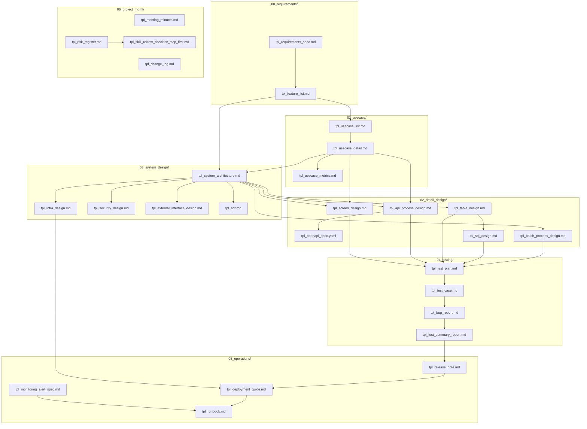

# Thu vien Template Tai lieu Ky thuat

Thu muc nay chua cac **template chuan** cho toan bo vong doi du an phan mem, tu giai doan thu thap yeu cau den van hanh san pham.

| Thu muc             | Nhom               | Muc dich                                     |
| ------------------- | ------------------ | -------------------------------------------- |
| `00_requirements/`  | Requirements       | Thu thap va dac ta yeu cau                   |
| `01_usecase/`       | Business Logic     | Phan tich va tai lieu hoa use case nghiep vu |
| `02_detail_design/` | Detail Design      | Thiet ke chi tiet ky thuat tu Basic Design   |
| `03_system_design/` | System Design      | Kien truc he thong, ha tang, bao mat         |
| `04_testing/`       | Testing            | Ke hoach, thuc hien va bao cao kiem thu      |
| `05_operations/`    | Operations         | Phat hanh, trien khai, van hanh              |
| `06_project_mgmt/`  | Project Management | Quan ly du an, rui ro, thay doi              |

---

## 00_requirements/ — Thu thap & Dac ta Yeu cau

Tai lieu nen tang truoc khi bat dau thiet ke.

| File                       | Loai tai lieu       | Muc dich ngan gon                                                    |
| -------------------------- | ------------------- | -------------------------------------------------------------------- |
| `tpl_requirements_spec.md` | Dac ta Yeu cau      | Yeu cau chuc nang + phi chuc nang, acceptance criteria, traceability |
| `tpl_feature_list.md`      | Danh sach Tinh nang | Catalogue tinh nang theo module, priority, user story, AC            |

**Khi nao dung:** Dau du an, truoc khi ve use case va thiet ke.

---

## 01_usecase/ — Business Logic Documentation

Tài liệu hoá use case nghiệp vụ từ kết quả phân tích/trace code.

| File                     | Loại tài liệu      | Mục đích ngắn gọn                                                    |
| ------------------------ | ------------------ | -------------------------------------------------------------------- |
| `tpl_usecase_list.md`    | Danh sách Use Case | Kết quả khám phá UC toàn module: meta, actors, flows, IPC mapping    |
| `tpl_usecase_detail.md`  | Chi tiết Use Case  | 1 UC đầy đủ: main/alt/error flow, sequence & class diagram, metrics  |
| `tpl_usecase_metrics.md` | Dashboard Metrics  | Theo dõi coverage UC, entry point, RISK=HIGH, error path toàn module |

### Khi nào dùng nhóm này

- Khi cần **phân tích nghiệp vụ** từ source code (reverse engineering)
- Khi cần **tài liệu hoá** flow cho team review hoặc onboarding
- Khi cần **trace** entry point, IPC communication, risk node
- Thứ tự tạo: `tpl_usecase_list.md` → `tpl_usecase_detail.md` (×N UC) → `tpl_usecase_metrics.md`

### Mô tả chi tiết

**`tpl_usecase_list.md`** — Lưu gì:

- Summary tổng số hàm/UC/entry point/IPC messages
- Định nghĩa mỗi UC: business goal, priority, risk, actors, entry points, flows, dependencies, related classes
- Overlap analysis giữa các UC
- Gap analysis + validation checkpoint

**`tpl_usecase_detail.md`** — Lưu gì:

- Meta (mã UC, ngày, người, trạng thái)
- Actors, Preconditions, Postconditions
- Main Flow dạng bảng (step → function → annotation tag)
- Alternate/Error flows kèm tag `FLOW=ALT/ERROR,RISK=HIGH`
- Critical checkpoints (Auth/Validation/Security/Performance)
- Sequence Diagram (Mermaid inline) — main + alt/error blocks
- Class Diagram (Mermaid inline) — domain objects + relationships
- Metrics UC, annotated nodes, inter-module IPC
- Edge cases, follow-up items, completion rules, version history

**`tpl_usecase_metrics.md`** — Lưu gì:

- UC Coverage, Entry Point Coverage, High Risk Trace, Error Path Coverage (số/phần trăm)
- Module relationships (direct calls, IPC, shared memory)
- Annotation taxonomy (ROLE/FLOW/RISK/STATE)
- Timeline, Next priorities, Quality gates checklist

---

## 02_detail_design/ — Technical Detail Design

Tài liệu thiết kế chi tiết kỹ thuật từ Basic Design.

| File                        | Loại tài liệu      | Mục đích ngắn gọn                                         |
| --------------------------- | ------------------ | --------------------------------------------------------- |
| `tpl_screen_design.md`      | Thiết kế Màn hình  | UI layout, luồng sự kiện, validation rules                |
| `tpl_api_process_design.md` | Thiết kế Xử lý API | Request/response spec, error codes, security, performance |
| `tpl_openapi_spec.yaml`     | OpenAPI Spec       | Machine-readable API spec (OpenAPI 3.1)                   |
| `tpl_table_design.md`       | Thiết kế Bảng DB   | Schema bảng, index, FK, ER diagram, CRUD examples         |
| `tpl_sql_design.md`         | Thiết kế SQL       | Câu truy vấn cụ thể (SELECT/INSERT/UPDATE), WHERE logic   |

### Khi nào dùng nhóm này

- Khi có **Basic Design** (オンライン処理概要書 / 画面遷移図) làm đầu vào
- Khi cần spec kỹ thuật cho **developer** (backend, frontend, DBA)
- Thứ tự điển hình: `tpl_table_design.md` → `tpl_sql_design.md` → `tpl_api_process_design.md` + `tpl_openapi_spec.yaml` → `tpl_screen_design.md`

### Mô tả chi tiết

**`tpl_screen_design.md`** — Nguồn: Basic Design Online / 画面遷移図

- Phần tử màn hình (field, type, default), luồng sự kiện (Search/Clear/Sort/Paging), validation rules, kết quả hiển thị

**`tpl_api_process_design.md`** — Nguồn: Basic Design Online

- HTTP method, endpoint, auth; request/response params; type constraints; flowchart; error codes; security; performance targets

**`tpl_openapi_spec.yaml`** — Nguồn: `tpl_api_process_design.md`

- OpenAPI 3.1 paths + components/schemas; SecuritySchemes; examples cho tất cả HTTP status

**`tpl_table_design.md`** — Nguồn: Basic Design Online / Batch

- Cột, index, FK, data type mapping, ER diagram (Mermaid), SQL examples, CRUD list

**`tpl_sql_design.md`** — Nguồn: Basic Design + `tpl_table_design.md`

- SQL parameters, câu truy vấn đầy đủ, WHERE logic, kết quả trả về, metadata

---

## 03_system_design/ — Thiet ke He thong

Kien truc he thong tong the, ha tang, bao mat va cac quyet dinh ky thuat.

| File                               | Loai tai lieu                | Muc dich ngan gon                                                |
| ---------------------------------- | ---------------------------- | ---------------------------------------------------------------- |
| `tpl_system_architecture.md`       | Kien truc He thong           | Component diagram, tech stack, pattern, giao tiep module         |
| `tpl_infra_design.md`              | Thiet ke Ha tang             | Server specs, network topology, storage, backup, cloud resources |
| `tpl_security_design.md`           | Thiet ke Bao mat             | Auth/authz, ma hoa, secrets, threat model, kiem tra bao mat      |
| `tpl_external_interface_design.md` | Giao dien He thong ngoai     | API/file/message contract voi he thong ben ngoai                 |
| `tpl_adr.md`                       | Architecture Decision Record | Lu lai quyet dinh kien truc va ly do chon                        |

**Khi nao dung:** Sau khi co requirements, truoc khi bat dau detail design.

---

## 04_testing/ — Kiem thu

| File                         | Loai tai lieu     | Muc dich ngan gon                                           |
| ---------------------------- | ----------------- | ----------------------------------------------------------- |
| `tpl_test_plan.md`           | Ke hoach Kiem thu | Chien luoc, pham vi, lich, moi truong, dieu kien entry/exit |
| `tpl_test_case.md`           | Test Case         | Ca kiem thu cu the: steps, expected result, data            |
| `tpl_bug_report.md`          | Bao cao Bug       | Mo ta loi, buoc tai hien, evidence, phan loai severity      |
| `tpl_test_summary_report.md` | Bao cao Tong ket  | Pass/fail counts, coverage, bug summary, sign-off           |

**Khi nao dung:** Song song voi development. Test plan truoc, test case khi dev feature, bao cao sau kiem thu.

---

## 05_operations/ — Van hanh

| File                           | Loai tai lieu        | Muc dich ngan gon                                             |
| ------------------------------ | -------------------- | ------------------------------------------------------------- |
| `tpl_release_note.md`          | Release Note         | Thong tin phien ban, tinh nang moi, bug fix, breaking changes |
| `tpl_deployment_guide.md`      | Huong dan Trien khai | Checklist trien khai len tung moi truong, rollback plan       |
| `tpl_runbook.md`               | Runbook              | Huong dan xu ly cac tinh huong van hanh thuong gap            |
| `tpl_monitoring_alert_spec.md` | Dac ta Giam sat      | Metrics, nguong canh bao, escalation, dashboard, health check |

**Khi nao dung:** Truoc khi deploy production (deployment guide, monitoring); luu hanh trong qua trinh van hanh (runbook, release note).

---

## 06_project_mgmt/ — Quan ly Du an

| File                     | Loai tai lieu        | Muc dich ngan gon                                             |
| ------------------------ | -------------------- | ------------------------------------------------------------- |
| `tpl_meeting_minutes.md` | Bien ban Cuoc hop    | Ket qua thao luan, quyet dinh, action items                   |
| `tpl_risk_register.md`   | So theo doi Rui ro   | Danh sach rui ro, likelihood, impact, bien phap giam thieu    |
| `tpl_change_log.md`      | So theo doi Thay doi | Thay doi yeu cau/thiet ke, anh huong, nguoi duyet, trang thai |
| `tpl_skill_review_checklist_mcp_first.md` | Checklist Review Skill | Checklist chấm điểm 100, critical fail, schema output review skill MCP-first |

**Khi nao dung:** Xuyen suot du an. Meeting minutes sau moi cuoc hop quan trong; risk register tu dau du an; change log khi co thay doi dac ta.

---

## Luong tai lieu theo vong doi du an

---

## Quy tac dat ten file output

| Template                           | Quy tac dat ten                                |
| ---------------------------------- | ---------------------------------------------- |
| `tpl_requirements_spec.md`         | `Requirements_Spec_{SystemID}_v{X.XX}.md`      |
| `tpl_feature_list.md`              | `Feature_List_{SystemID}_v{X.XX}.md`           |
| `tpl_usecase_list.md`              | `usecases_list_{ModuleID}.md`                  |
| `tpl_usecase_detail.md`            | `uc{NNN}_{usecase_name}.md`                    |
| `tpl_usecase_metrics.md`           | `usecase_trace_metrics_{ModuleID}.md`          |
| `tpl_system_architecture.md`       | `System_Architecture_{SystemID}_v{X.XX}.md`    |
| `tpl_infra_design.md`              | `Infra_Design_{SystemID}_v{X.XX}.md`           |
| `tpl_security_design.md`           | `Security_Design_{SystemID}_v{X.XX}.md`        |
| `tpl_external_interface_design.md` | `External_Interface_{InterfaceID}_v{X.XX}.md`  |
| `tpl_adr.md`                       | `ADR_{NNN}_{short_title}.md`                   |
| `tpl_screen_design.md`             | `Screen_Design_{ScreenID}_{Name}_v{X.XX}.md`   |
| `tpl_api_process_design.md`        | `API_Process_Design_{APIID}_{Name}_v{X.XX}.md` |
| `tpl_openapi_spec.yaml`            | `openapi_spec_{APIID}_{Name}_v{X.XX}.yaml`     |
| `tpl_table_design.md`              | `Table_Design_{TableID}_{Name}_v{X.XX}.md`     |
| `tpl_sql_design.md`                | `SQL_Design_{SQLID}_{Name}_v{X.XX}.md`         |
| `tpl_batch_process_design.md`      | `Batch_Design_{BatchID}_{Name}_v{X.XX}.md`     |
| `tpl_test_plan.md`                 | `Test_Plan_{SystemID}_{Release}_v{X.XX}.md`    |
| `tpl_test_case.md`                 | `Test_Case_{ModuleID}_{Name}_v{X.XX}.md`       |
| `tpl_bug_report.md`                | `Bug_Report_BUG{NNN}.md`                       |
| `tpl_test_summary_report.md`       | `Test_Summary_{SystemID}_{Release}.md`         |
| `tpl_release_note.md`              | `Release_Note_{SystemID}_v{X.XX}.md`           |
| `tpl_deployment_guide.md`          | `Deployment_Guide_{SystemID}_v{X.XX}.md`       |
| `tpl_runbook.md`                   | `Runbook_{SystemID}_{Scenario}.md`             |
| `tpl_monitoring_alert_spec.md`     | `Monitoring_Alert_Spec_{SystemID}_v{X.XX}.md`  |
| `tpl_meeting_minutes.md`           | `Meeting_{YYYY-MM-DD}_{Topic}.md`              |
| `tpl_risk_register.md`             | `Risk_Register_{SystemID}.md`                  |
| `tpl_change_log.md`                | `Change_Log_{SystemID}.md`                     |
| `tpl_skill_review_checklist_mcp_first.md` | `Skill_Review_{SkillName}_{YYYY-MM-DD}.md` |
